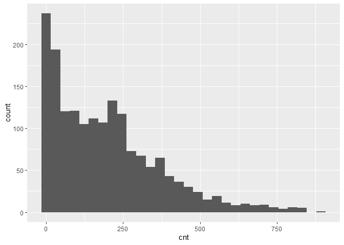
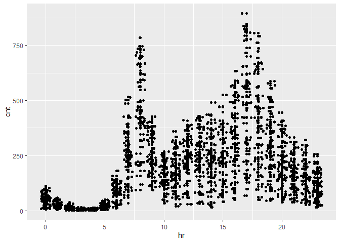
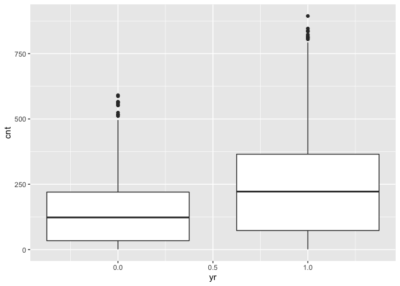

Friday
================
Shih-Ni Prim
2020-10-07

  - [Introduction](#introduction)
  - [Data](#data)
  - [Splitting up to training and test
    sets](#splitting-up-to-training-and-test-sets)
  - [Fitting models](#fitting-models)
      - [Regression tree](#regression-tree)
      - [Boosted Tree](#boosted-tree)
      - [Comparison](#comparison)

This is Friday’s analysis.

## Introduction

This about bike share shows the information about each day–hours,
temperature, humidity, weekday, holiday/workday or not, etc.

Since the current analysis is on Friday, we first find the corresponding
value for it.

``` r
set.seed(7777)
i <- 0:6
dayz <- c("Sunday", "Monday", "Tuesday", "Wednesday", "Thursday", "Friday", "Saturday")
df <- as.data.frame(cbind(i, dayz))
weekdayNum <- df$i[df$dayz == params$weekday]
print(weekdayNum)
```

    ## [1] "5"

## Data

Now we read in the data.

``` r
bikes <- read_csv("../Bike-Sharing-Dataset/hour.csv")
```

    ## Parsed with column specification:
    ## cols(
    ##   instant = col_double(),
    ##   dteday = col_date(format = ""),
    ##   season = col_double(),
    ##   yr = col_double(),
    ##   mnth = col_double(),
    ##   hr = col_double(),
    ##   holiday = col_double(),
    ##   weekday = col_double(),
    ##   workingday = col_double(),
    ##   weathersit = col_double(),
    ##   temp = col_double(),
    ##   atemp = col_double(),
    ##   hum = col_double(),
    ##   windspeed = col_double(),
    ##   casual = col_double(),
    ##   registered = col_double(),
    ##   cnt = col_double()
    ## )

``` r
# head(bikes)
analysis <- bikes %>% filter(weekday == weekdayNum) %>% select(-casual, -registered) %>% select(dteday, weekday, everything()) 
# head(analysis)
```

## Splitting up to training and test sets

``` r
train <- sample(1:nrow(analysis), size = nrow(analysis)*0.7)
test <- setdiff(1:nrow(analysis), train)

bikeTrain <- analysis[train,]
bikeTest <- analysis[test,]
```

``` r
ggplot(bikeTrain, mapping = aes(x = cnt)) + geom_histogram()
```

    ## `stat_bin()` using `bins = 30`. Pick better value with `binwidth`.

<!-- -->

``` r
ggplot(bikeTrain, aes(x = hr, y = cnt)) + geom_point() + geom_jitter()
```

<!-- -->

``` r
ggplot(bikeTrain, aes(x = yr, y = cnt)) + geom_boxplot(aes(group = yr))
```

<!-- -->

``` r
cor(bikeTrain$mnth, bikeTrain$season)
```

    ## [1] 0.80216

``` r
ggplot(bikeTrain, aes(x = weathersit, y = windspeed)) + geom_jitter()
```

<!-- -->

``` r
cor(bikeTrain$holiday, bikeTrain$workingday)
```

    ## [1] -1

``` r
cor(bikeTrain$temp, bikeTrain$atemp)
```

    ## [1] 0.9636363

``` r
var(bikeTrain$holiday)
```

    ## [1] 0.01806296

``` r
var(bikeTrain$workingday)
```

    ## [1] 0.01806296

`mnth` and `season` as well as `workingday` and `holiday` are highly
correlated. Also, `instant` and `dteday` are for record-keeping. The
variance of `workingday` and `holiday` is 0 or too small. Thus, we
decide to keep these as the predictors: `season`, `yr`, `hr`,
`weathersit`, `atemp`, `hum`, and `windspeed`.

``` r
bikeTrain <- select(bikeTrain, season, yr, hr, weathersit, atemp, hum, windspeed, cnt)
bikeTest <- select(bikeTest, season, yr, hr, weathersit, atemp, hum, windspeed, cnt)
```

## Fitting models

### Regression tree

``` r
modelLookup("rpart")

bikeTree <- train(cnt ~ ., data = bikeTrain, method = "rpart", trControl = trainControl(method = "LOOCV"), tuneLength = 10)

predTree <- predict(bikeTree, newdata = bikeTest)
treeRMSE <- sqrt(mean((predTree - bikeTest$cnt)^2))
postResample(predTree, bikeTest$cnt)
```

    ##       RMSE   Rsquared        MAE 
    ## 84.9477745  0.7681535 59.9080146

### Boosted Tree

``` r
modelLookup("gbm")

boostedBike <- train(cnt ~  season + yr + hr + weathersit + atemp + hum + windspeed, data = bikeTrain, method = "gbm", preProcess = c("center", "scale"), trControl = trainControl(method = "repeatedcv", number = 10, repeats = 3), tuneLength = 5, verbose = FALSE)
predBoostedBike <- predict(boostedBike, newdata = select(bikeTest, -cnt))
boostedRMSE <- sqrt(mean((predBoostedBike - bikeTest$cnt)^2))
postResample(predBoostedBike, bikeTest$cnt)
```

    ##       RMSE   Rsquared        MAE 
    ## 48.3073929  0.9255306 31.7689062

### Comparison

``` r
comparison <- data.frame(treeRMSE, boostedRMSE)
colnames(comparison) <- c("Regression Tree", "Boosted Tree")
rownames(comparison) <- c("RMSE")
print(comparison)
```

``` r
model <- function(x, y){
  if (x > y) {
    final <- c("boosted tree")
  }
  else {
    final <- c("regression tree")
  }
  return(final)
}

# model(treeRMSE, boostedRMSE)
```

From the output, we can conclude that boosted tree is the better model.
