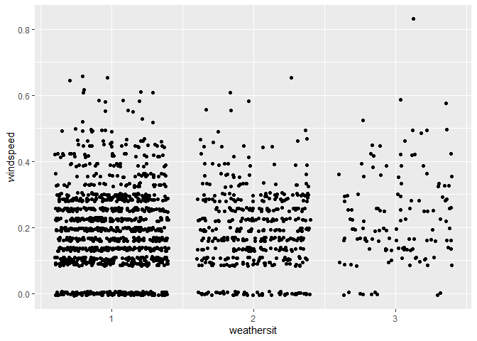
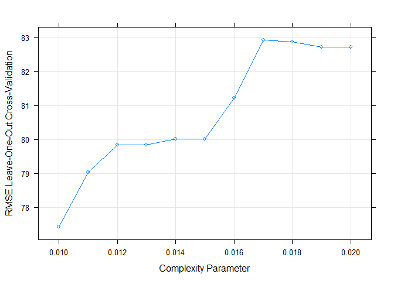

Saturday
================
Shih-Ni Prim
2020-10-11

  - [Introduction](#introduction)
  - [Setting the Value for the
    Parameter](#setting-the-value-for-the-parameter)
  - [Data](#data)
  - [Splitting Data](#splitting-data)
  - [Summaries and Exploratory Data
    Analysis](#summaries-and-exploratory-data-analysis)
  - [Fitting models](#fitting-models)
      - [Regression tree](#regression-tree)
      - [Boosted Tree](#boosted-tree)
      - [Comparison](#comparison)
      - [Final Model](#final-model)

## Introduction

Now we take a look at Saturday’s analysis. This dataset contains
information about [bike
sharing](https://archive.ics.uci.edu/ml/datasets/Bike+Sharing+Dataset).
We have a variety of predictors, including hours, temperature, humidity,
weekday, holiday/workday or not, etc. In our analysis, We will use two
statistical learning models–regression tree and boosted tree–to predict
the count of total rental bikes `cnt`.

## Setting the Value for the Parameter

Since the current analysis is on Saturday, we first find the
corresponding value for it.

``` r
set.seed(7777)
i <- 0:6
dayz <- c("Sunday", "Monday", "Tuesday", "Wednesday", "Thursday", "Friday", "Saturday")
df <- as.data.frame(cbind(i, dayz))
weekdayNum <- df$i[df$dayz == params$weekday]
print(weekdayNum)
```

    ## [1] "6"

## Data

Now we read in the data. Two datasets are listed on [the
link](https://archive.ics.uci.edu/ml/datasets/Bike+Sharing+Dataset), one
including the `hr` variable, and one treating each day as one
observation and thus not including the `hr` variable. Since hours–the
time in the day–should be a meaningful predictor for the number of bike
rentals, we use the dataset with the `hr` variable

``` r
bikes <- read_csv("../Bike-Sharing-Dataset/hour.csv")
```

    ## Parsed with column specification:
    ## cols(
    ##   instant = col_double(),
    ##   dteday = col_date(format = ""),
    ##   season = col_double(),
    ##   yr = col_double(),
    ##   mnth = col_double(),
    ##   hr = col_double(),
    ##   holiday = col_double(),
    ##   weekday = col_double(),
    ##   workingday = col_double(),
    ##   weathersit = col_double(),
    ##   temp = col_double(),
    ##   atemp = col_double(),
    ##   hum = col_double(),
    ##   windspeed = col_double(),
    ##   casual = col_double(),
    ##   registered = col_double(),
    ##   cnt = col_double()
    ## )

``` r
# head(bikes)
analysis <- bikes %>% filter(weekday == weekdayNum) %>% select(-casual, -registered) %>% select(dteday, weekday, everything()) 
# head(analysis)
```

## Splitting Data

We first split up the data into two sets: training and test sets. The
training set has about 70% of the data, and the test set has about 30%.
Splitting up the data is important, because we want to test the model on
a set that is not used in training, otherwise we risk overfitting.

``` r
train <- sample(1:nrow(analysis), size = nrow(analysis)*0.7)
test <- setdiff(1:nrow(analysis), train)

bikeTrain <- analysis[train,]
bikeTest <- analysis[test,]
```

## Summaries and Exploratory Data Analysis

To decide which variables to include in our models, we first take a
quick look at the data. We can look at summaries of numerical variables.

``` r
summary(bikeTrain)
```

    ##      dteday              weekday     instant          season            yr        
    ##  Min.   :2011-01-01   Min.   :6   Min.   :    1   Min.   :1.000   Min.   :0.0000  
    ##  1st Qu.:2011-06-25   1st Qu.:6   1st Qu.: 4128   1st Qu.:1.000   1st Qu.:0.0000  
    ##  Median :2011-12-31   Median :6   Median : 8622   Median :2.000   Median :0.0000  
    ##  Mean   :2011-12-26   Mean   :6   Mean   : 8540   Mean   :2.464   Mean   :0.4898  
    ##  3rd Qu.:2012-06-23   3rd Qu.:6   3rd Qu.:12834   3rd Qu.:3.000   3rd Qu.:1.0000  
    ##  Max.   :2012-12-29   Max.   :6   Max.   :17331   Max.   :4.000   Max.   :1.0000  
    ##       mnth             hr           holiday    workingday   weathersit         temp       
    ##  Min.   : 1.00   Min.   : 0.00   Min.   :0   Min.   :0    Min.   :1.000   Min.   :0.0200  
    ##  1st Qu.: 3.00   1st Qu.: 6.00   1st Qu.:0   1st Qu.:0    1st Qu.:1.000   1st Qu.:0.3200  
    ##  Median : 6.00   Median :12.00   Median :0   Median :0    Median :1.000   Median :0.4800  
    ##  Mean   : 6.48   Mean   :11.67   Mean   :0   Mean   :0    Mean   :1.409   Mean   :0.4848  
    ##  3rd Qu.: 9.00   3rd Qu.:18.00   3rd Qu.:0   3rd Qu.:0    3rd Qu.:2.000   3rd Qu.:0.6400  
    ##  Max.   :12.00   Max.   :23.00   Max.   :0   Max.   :0    Max.   :3.000   Max.   :1.0000  
    ##      atemp             hum           windspeed           cnt       
    ##  Min.   :0.0000   Min.   :0.1200   Min.   :0.0000   Min.   :  1.0  
    ##  1st Qu.:0.3182   1st Qu.:0.4500   1st Qu.:0.1045   1st Qu.: 43.0  
    ##  Median :0.4697   Median :0.6200   Median :0.1940   Median :133.0  
    ##  Mean   :0.4646   Mean   :0.6197   Mean   :0.1951   Mean   :190.8  
    ##  3rd Qu.:0.6212   3rd Qu.:0.7900   3rd Qu.:0.2836   3rd Qu.:300.0  
    ##  Max.   :0.8939   Max.   :1.0000   Max.   :0.8358   Max.   :783.0

Below we look at three plots. The first plot shows the histogram of bike
rentals (`cnt`) on Saturday. The second plot shows that `cnt` does vary
in different hours. The third plot shows that `cnt` varies between the
two years. So we know we should keep `hr` and `yr` as predictors.

``` r
ggplot(bikeTrain, mapping = aes(x = cnt)) + geom_histogram()
```

    ## `stat_bin()` using `bins = 30`. Pick better value with `binwidth`.

<!-- -->

``` r
ggplot(bikeTrain, aes(x = hr, y = cnt)) + geom_point() + geom_jitter()
```

<!-- -->

``` r
ggplot(bikeTrain, aes(x = yr, y = cnt)) + geom_boxplot(aes(group = yr))
```

<!-- -->

Next we look at correlations of different variables. Weather and
windspeed do not seem correlate, so we will keep both `weathersit` and
`windspeed`.

``` r
ggplot(bikeTrain, aes(x = weathersit, y = windspeed)) + geom_jitter()
```

<!-- -->

Several pairs of variables seem highly correlated–`season` and `mnth`,
`holiday` and `workingday`–so we’ll remove one from each pair.

``` r
cor(bikeTrain$season, bikeTrain$mnth)
```

    ## [1] 0.8063518

``` r
cor(bikeTrain$holiday, bikeTrain$workingday)
```

    ## [1] NA

``` r
cor(bikeTrain$temp, bikeTrain$atemp)
```

    ## [1] 0.9922486

The variance of `workingday` and `holiday` are too small and probably
not good predictors.

``` r
var(bikeTrain$holiday)
```

    ## [1] 0

``` r
var(bikeTrain$workingday)
```

    ## [1] 0

Also, `instant` and `dteday` are for record-keeping. Thus, we decide to
keep the following variables as the predictors: `season`, `yr`, `hr`,
`weathersit`, `atemp`, `hum`, and `windspeed`.

``` r
bikeTrain <- select(bikeTrain, season, yr, hr, weathersit, atemp, hum, windspeed, cnt)
bikeTest <- select(bikeTest, season, yr, hr, weathersit, atemp, hum, windspeed, cnt)
```

## Fitting models

Now we have a final training set and have chosen the predictors, we can
use two models–regression tree and boosted tree–to fit the training
data.

### Regression tree

A regression tree is one of the tree based methods for supervised
learning with the goal of predicting a continuous response. It splits up
predictor space into different regions, and the prediction of each
region is often the mean of observations in that region.

For regression tree, we use the `caret` package and apply the
leave-one-out cross validation method (thus the argument `method =
"LOOCV"`). We set the `tuneLength` as 10 and let the model chooses the
best model automatically. Below we can see the resulting RMSE, Rsquared,
and MAE of different cp as well as a plot that visualizes this
information.

Finally we use the model to predict `cnt` on the test data and calculate
RMSE to check the fit of the model.

``` r
modelLookup("rpart")

bikeTree <- train(cnt ~ ., data = bikeTrain, method = "rpart", trControl = trainControl(method = "LOOCV"), tuneLength = 10)
bikeTree
```

    ## CART 
    ## 
    ## 1758 samples
    ##    7 predictor
    ## 
    ## No pre-processing
    ## Resampling: Leave-One-Out Cross-Validation 
    ## Summary of sample sizes: 1757, 1757, 1757, 1757, 1757, 1757, ... 
    ## Resampling results across tuning parameters:
    ## 
    ##   cp           RMSE       Rsquared     MAE      
    ##   0.007040770   75.07932  0.824945618   56.88111
    ##   0.007904336   78.97136  0.806597511   59.27433
    ##   0.008484117   78.81065  0.807123689   59.42330
    ##   0.011555841   80.83218  0.797371170   60.48926
    ##   0.017242508   84.55271  0.778297129   62.60730
    ##   0.022968387   97.75367  0.703617888   73.22815
    ##   0.066900261  110.62617  0.621492097   81.23792
    ##   0.088842295  124.78729  0.524106452   92.11094
    ##   0.197480370  157.58921  0.262023117  122.78626
    ##   0.370550844  187.30826  0.000360873  168.91480
    ## 
    ## RMSE was used to select the optimal model using the smallest value.
    ## The final value used for the model was cp = 0.00704077.

``` r
plot(bikeTree)
```

<!-- -->

``` r
predTree <- predict(bikeTree, newdata = bikeTest)
treeResult <- postResample(predTree, bikeTest$cnt)
```

### Boosted Tree

A boosted tree is one of the ensemble learning methods, in which the
tree grows sequentially. Each subsequent tree is combined into the
previous model to produce a modified model. The predictions are updated
as the tree grows.

We again use `caret` package and set the method as `gbm`. We use
repeated cross validation (`repeatedcv`) and set the `tuneLength` as 10
and let the model chooses the best model automatically. We can then see
the importance of each variable and a plot that shows how RMSE changes
with different numbers of boosting iterations and tree depths.

Finally, we use the model to predict `cnt` on the test data and
calculate RMSE to check the fit of the model.

``` r
modelLookup("gbm")

boostedBike <- train(cnt ~  season + yr + hr + weathersit + atemp + hum + windspeed, data = bikeTrain, method = "gbm", preProcess = c("center", "scale"), trControl = trainControl(method = "repeatedcv", number = 10, repeats = 3), tuneLength = 10, verbose = FALSE)
summary(boostedBike)
```

<!-- -->

``` r
plot(boostedBike)
```

<!-- -->

``` r
predBoostedBike <- predict(boostedBike, newdata = select(bikeTest, -cnt))
boostedResult <- postResample(predBoostedBike, bikeTest$cnt)
```

### Comparison

We can put the testing RMSE from the two models together for comparison.

``` r
comparison <- data.frame(rbind(t(treeResult), t(boostedResult)))
colnames(comparison) <- c("RMSE", "Rsquared", "MAE")
rownames(comparison) <- c("Regression Tree", "Boosted Tree")
knitr::kable(comparison)
```

|                 |     RMSE |  Rsquared |      MAE |
| :-------------- | -------: | --------: | -------: |
| Regression Tree | 76.55784 | 0.8213449 | 57.91357 |
| Boosted Tree    | 39.82217 | 0.9514309 | 26.68246 |

### Final Model

``` r
# a function to generate the name of the best model
model <- function(x, y){
  xscore <- 0
  if (x[[1]] < y[[1]]) {
    xscore = xscore + 1
  }
  if (x[[2]] > y[[2]]){
    xscore = xscore + 1
  }
  if (x[[3]] < y[[3]]){
    xscore = xscore + 1
  }
  if (xscore == 2 || xscore == 3){
    final <- c("regression tree")
  } else {
    final <- c("boosted tree")
  }
  return(final)
}
# model(treeResult, boostedResult)
```

From the output, we can conclude that the boosted tree is the better
model for Saturday data, because it has better performance in terms of
RMSE, Rsquared, and MAE.
