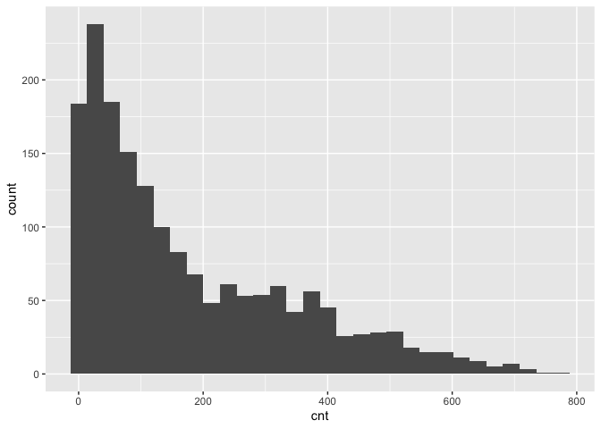
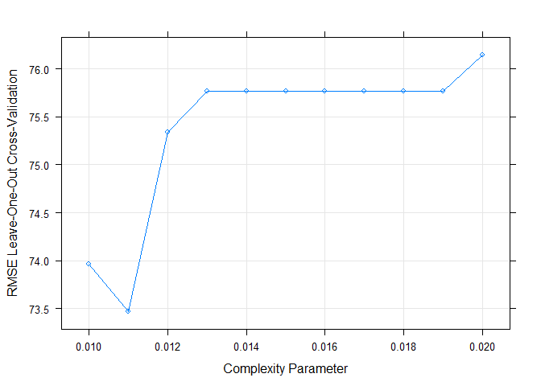
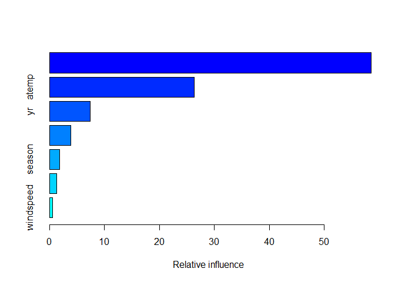
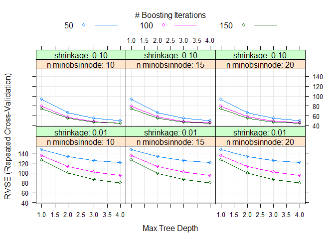

Sunday
================
Shih-Ni Prim
2020-10-16

  - [Introduction](#introduction)
  - [Setting the Value for the
    Parameter](#setting-the-value-for-the-parameter)
  - [Data](#data)
  - [Splitting Data](#splitting-data)
  - [Summaries and Exploratory Data
    Analysis](#summaries-and-exploratory-data-analysis)
  - [Fitting models](#fitting-models)
      - [Regression tree](#regression-tree)
      - [Boosted Tree](#boosted-tree)
      - [Linear Regression Model](#linear-regression-model)
      - [Comparison](#comparison)
      - [Final Model](#final-model)

## Introduction

Now we take a look at Sunday’s analysis. This dataset contains
information about [bike
sharing](https://archive.ics.uci.edu/ml/datasets/Bike+Sharing+Dataset).
We have a variety of predictors, including hours, temperature, humidity,
weekday, holiday/workday or not, etc. In our analysis, We will use two
statistical learning models–regression tree and boosted tree–to predict
the count of total rental bikes `cnt`.

## Setting the Value for the Parameter

Since the current analysis is on Sunday, we first find the corresponding
value for it.

``` r
set.seed(7777)
i <- 0:6
dayz <- c("Sunday", "Monday", "Tuesday", "Wednesday", "Thursday", "Friday", "Saturday")
df <- as.data.frame(cbind(i, dayz))
weekdayNum <- df$i[df$dayz == params$weekday]
print(weekdayNum)
```

    ## [1] "0"

## Data

Now we read in the data. Two datasets are listed on [the
link](https://archive.ics.uci.edu/ml/datasets/Bike+Sharing+Dataset), one
including the `hr` variable, and one treating each day as one
observation and thus not including the `hr` variable. Since hours–the
time in the day–should be a meaningful predictor for the number of bike
rentals, we use the dataset with the `hr` variable

``` r
bikes <- read_csv("Bike-Sharing-Dataset/hour.csv")
```

    ## Parsed with column specification:
    ## cols(
    ##   instant = col_double(),
    ##   dteday = col_date(format = ""),
    ##   season = col_double(),
    ##   yr = col_double(),
    ##   mnth = col_double(),
    ##   hr = col_double(),
    ##   holiday = col_double(),
    ##   weekday = col_double(),
    ##   workingday = col_double(),
    ##   weathersit = col_double(),
    ##   temp = col_double(),
    ##   atemp = col_double(),
    ##   hum = col_double(),
    ##   windspeed = col_double(),
    ##   casual = col_double(),
    ##   registered = col_double(),
    ##   cnt = col_double()
    ## )

``` r
# head(bikes)
analysis <- bikes %>% filter(weekday == weekdayNum) %>% select(-casual, -registered) %>% select(dteday, weekday, everything()) 
# head(analysis)
```

## Splitting Data

We first split up the data into two sets: training and test sets. The
training set has about 70% of the data, and the test set has about 30%.
Splitting up the data is important, because we want to test the model on
a set that is not used in training, otherwise we risk overfitting.

``` r
train <- sample(1:nrow(analysis), size = nrow(analysis)*0.7)
test <- setdiff(1:nrow(analysis), train)

bikeTrain <- analysis[train,]
bikeTest <- analysis[test,]
```

## Summaries and Exploratory Data Analysis

To decide which variables to include in our models, we first take a
quick look at the data. We can look at summaries of numerical variables.

``` r
summary(bikeTrain)
```

    ##      dteday              weekday     instant          season     
    ##  Min.   :2011-01-02   Min.   :0   Min.   :   25   Min.   :1.000  
    ##  1st Qu.:2011-07-03   1st Qu.:0   1st Qu.: 4304   1st Qu.:1.000  
    ##  Median :2012-01-01   Median :0   Median : 8652   Median :2.000  
    ##  Mean   :2011-12-30   Mean   :0   Mean   : 8615   Mean   :2.471  
    ##  3rd Qu.:2012-07-01   3rd Qu.:0   3rd Qu.:13006   3rd Qu.:3.000  
    ##  Max.   :2012-12-30   Max.   :0   Max.   :17355   Max.   :4.000  
    ##        yr             mnth              hr           holiday    workingday
    ##  Min.   :0.000   Min.   : 1.000   Min.   : 0.00   Min.   :0   Min.   :0   
    ##  1st Qu.:0.000   1st Qu.: 4.000   1st Qu.: 6.00   1st Qu.:0   1st Qu.:0   
    ##  Median :1.000   Median : 7.000   Median :12.00   Median :0   Median :0   
    ##  Mean   :0.502   Mean   : 6.444   Mean   :11.59   Mean   :0   Mean   :0   
    ##  3rd Qu.:1.000   3rd Qu.: 9.000   3rd Qu.:18.00   3rd Qu.:0   3rd Qu.:0   
    ##  Max.   :1.000   Max.   :12.000   Max.   :23.00   Max.   :0   Max.   :0   
    ##    weathersit         temp            atemp             hum        
    ##  Min.   :1.000   Min.   :0.0200   Min.   :0.0455   Min.   :0.1700  
    ##  1st Qu.:1.000   1st Qu.:0.3400   1st Qu.:0.3333   1st Qu.:0.4800  
    ##  Median :1.000   Median :0.4800   Median :0.4697   Median :0.6400  
    ##  Mean   :1.367   Mean   :0.4845   Mean   :0.4658   Mean   :0.6285  
    ##  3rd Qu.:2.000   3rd Qu.:0.6400   3rd Qu.:0.6061   3rd Qu.:0.7800  
    ##  Max.   :3.000   Max.   :0.9400   Max.   :0.8939   Max.   :1.0000  
    ##    windspeed           cnt       
    ##  Min.   :0.0000   Min.   :  1.0  
    ##  1st Qu.:0.1045   1st Qu.: 42.0  
    ##  Median :0.1642   Median :118.0  
    ##  Mean   :0.1894   Mean   :178.7  
    ##  3rd Qu.:0.2537   3rd Qu.:288.5  
    ##  Max.   :0.8507   Max.   :776.0

Below we look at three plots. The first plot shows the histogram of bike
rentals (`cnt`) on Sunday. The second plot shows that `cnt` does vary in
different hours. The third plot shows that `cnt` varies between the two
years. So we know we should keep `hr` and `yr` as predictors.

``` r
ggplot(bikeTrain, mapping = aes(x = cnt)) + geom_histogram()
```

    ## `stat_bin()` using `bins = 30`. Pick better value with `binwidth`.

<!-- -->

``` r
ggplot(bikeTrain, aes(x = hr, y = cnt)) + geom_point() + geom_jitter()
```

<!-- -->

``` r
ggplot(bikeTrain, aes(x = yr, y = cnt)) + geom_boxplot(aes(group = yr))
```

<!-- -->

Next we look at correlations of different variables. Weather and
windspeed do not seem correlate, so we will keep both `weathersit` and
`windspeed`.

``` r
ggplot(bikeTrain, aes(x = weathersit, y = windspeed)) + geom_jitter()
```

<!-- -->

Several pairs of variables seem highly correlated–`season` and `mnth`,
`holiday` and `workingday`–so we’ll remove one from each pair.

``` r
cor(bikeTrain$season, bikeTrain$mnth)
```

    ## [1] 0.8354802

``` r
cor(bikeTrain$holiday, bikeTrain$workingday)
```

    ## Warning in cor(bikeTrain$holiday, bikeTrain$workingday): the standard deviation
    ## is zero

    ## [1] NA

``` r
cor(bikeTrain$temp, bikeTrain$atemp)
```

    ## [1] 0.993001

The variance of `workingday` and `holiday` are too small and probably
not good predictors.

``` r
var(bikeTrain$holiday)
```

    ## [1] 0

``` r
var(bikeTrain$workingday)
```

    ## [1] 0

Also, `instant` and `dteday` are for record-keeping. Thus, we decide to
keep the following variables as the predictors: `season`, `yr`, `hr`,
`weathersit`, `atemp`, `hum`, and `windspeed`.

``` r
bikeTrain <- select(bikeTrain, season, yr, hr, weathersit, atemp, hum, windspeed, cnt)
bikeTest <- select(bikeTest, season, yr, hr, weathersit, atemp, hum, windspeed, cnt)
```

## Fitting models

Now we have a final training set and have chosen the predictors, we can
use two models–regression tree and boosted tree–to fit the training
data.

### Regression tree

A regression tree is one of the tree based methods for supervised
learning with the goal of predicting a continuous response. It splits up
predictor space into different regions, and the prediction of each
region is often the mean of observations in that region.

For regression tree, we use the `caret` package and apply the
leave-one-out cross validation method (thus the argument `method =
"LOOCV"`). We set the `tuneLength` as 10 and let the model chooses the
best model automatically.

``` r
modelLookup("rpart")
```

    ##   model parameter                label forReg forClass probModel
    ## 1 rpart        cp Complexity Parameter   TRUE     TRUE      TRUE

``` r
bikeTree <- train(cnt ~ ., data = bikeTrain, method = "rpart", trControl = trainControl(method = "LOOCV"), tuneGrid = expand.grid(cp = seq(0.01, 0.02, 0.001)))
```

Below we can see the final model; the resulting RMSE, Rsquared, and MAE
of different cp; and a plot that shows the relationship between cp and
RMSE.

``` r
bikeTree$finalModel
```

    ## n= 1751 
    ## 
    ## node), split, n, deviance, yval
    ##       * denotes terminal node
    ## 
    ##  1) root 1751 49512530.0 178.73560  
    ##    2) hr< 9.5 706  2244280.0  58.03824  
    ##      4) hr< 8.5 633  1197547.0  48.06635 *
    ##      5) hr>=8.5 73   437980.2 144.50680 *
    ##    3) hr>=9.5 1045 30034890.0 260.27850  
    ##      6) atemp< 0.47725 488  6542796.0 158.56760  
    ##       12) hr>=17.5 222   644955.9  79.86486 *
    ##       13) hr< 17.5 266  3375108.0 224.25190  
    ##         26) atemp< 0.4015 169  1258127.0 177.04140 *
    ##         27) atemp>=0.4015 97  1084046.0 306.50520 *
    ##      7) atemp>=0.47725 557 14020670.0 349.38960  
    ##       14) hr>=19.5 142   746615.0 164.08450 *
    ##       15) hr< 19.5 415  6729648.0 412.79520  
    ##         30) yr< 0.5 207  1135643.0 331.11590 *
    ##         31) yr>=0.5 208  2838644.0 494.08170 *

``` r
bikeTree
```

    ## CART 
    ## 
    ## 1751 samples
    ##    7 predictor
    ## 
    ## No pre-processing
    ## Resampling: Leave-One-Out Cross-Validation 
    ## Summary of sample sizes: 1750, 1750, 1750, 1750, 1750, 1750, ... 
    ## Resampling results across tuning parameters:
    ## 
    ##   cp     RMSE      Rsquared   MAE     
    ##   0.010  73.96290  0.8065388  55.70757
    ##   0.011  73.47283  0.8090933  55.46271
    ##   0.012  75.33872  0.7993980  56.43773
    ##   0.013  75.76538  0.7969935  57.63694
    ##   0.014  75.76538  0.7969935  57.63694
    ##   0.015  75.76538  0.7969935  57.63694
    ##   0.016  75.76538  0.7969935  57.63694
    ##   0.017  75.76538  0.7969935  57.63694
    ##   0.018  75.76538  0.7969935  57.63694
    ##   0.019  75.76538  0.7969935  57.63694
    ##   0.020  76.14102  0.7949783  57.72922
    ## 
    ## RMSE was used to select the optimal model using the smallest value.
    ## The final value used for the model was cp = 0.011.

``` r
plot(bikeTree)
```

<!-- -->

Finally we use the model to predict `cnt` on the test data and calculate
RMSE to check the fit of the model.

``` r
predTree <- predict(bikeTree, newdata = bikeTest)
treeResult <- postResample(predTree, bikeTest$cnt)
```

### Boosted Tree

A boosted tree is one of the ensemble learning methods, in which the
tree grows sequentially. Each subsequent tree is combined into the
previous model to produce a modified model. The predictions are updated
as the tree grows.

We again use `caret` package and set the method as `gbm`. We use
repeated cross validation (`repeatedcv`) and set the `tuneLength` as 10
and let the model chooses the best model automatically.

``` r
modelLookup("gbm")
```

    ##   model         parameter                   label forReg forClass probModel
    ## 1   gbm           n.trees   # Boosting Iterations   TRUE     TRUE      TRUE
    ## 2   gbm interaction.depth          Max Tree Depth   TRUE     TRUE      TRUE
    ## 3   gbm         shrinkage               Shrinkage   TRUE     TRUE      TRUE
    ## 4   gbm    n.minobsinnode Min. Terminal Node Size   TRUE     TRUE      TRUE

``` r
grid <- expand.grid(n.trees = c(50, 100, 150), interaction.depth = 1:4, shrinkage = c(0.1, 0.01), n.minobsinnode = c(10, 15, 20))

boostedBike <- train(cnt ~  season + yr + hr + weathersit + atemp + hum + windspeed, data = bikeTrain, method = "gbm", preProcess = c("center", "scale"), trControl = trainControl(method = "repeatedcv", number = 10, repeats = 3), tuneGrid = grid, verbose = FALSE)
```

Below we can see some information about the final model, the predictors
chosen and their importance, and a plot that shows how RMSE changes with
different numbers of boosting iterations and tree depths.

``` r
boostedBike$finalModel
```

    ## A gradient boosted model with gaussian loss function.
    ## 150 iterations were performed.
    ## There were 7 predictors of which 7 had non-zero influence.

``` r
summary(boostedBike)
```

<!-- -->

    ##                   var    rel.inf
    ## hr                 hr 58.5746556
    ## atemp           atemp 26.3190171
    ## yr                 yr  7.3930779
    ## hum               hum  3.9369616
    ## season         season  1.8630663
    ## weathersit weathersit  1.3502360
    ## windspeed   windspeed  0.5629856

``` r
plot(boostedBike)
```

<!-- -->

Finally, we use the model to predict `cnt` on the test data and
calculate RMSE to check the fit of the model.

``` r
predBoostedBike <- predict(boostedBike, newdata = select(bikeTest, -cnt))
boostedResult <- postResample(predBoostedBike, bikeTest$cnt)
```

### Linear Regression Model

A linear regression model fits a straight line to he data by minimizing
the sum of squared residuals.

We again use `caret` package and set the method as `lm`.

``` r
library(caret)

linearBike <- train(cnt ~  season + yr + hr + weathersit + atemp + hum + windspeed, data = bikeTrain, method = "lm", preProcess = c("center", "scale"))
```

Below we can see the summary for the linear model.

``` r
linearBike$finalModel
```

    ## 
    ## Call:
    ## lm(formula = .outcome ~ ., data = dat)
    ## 
    ## Coefficients:
    ## (Intercept)       season           yr           hr   weathersit        atemp  
    ##     178.736       21.846       28.123       34.987        2.250       75.577  
    ##         hum    windspeed  
    ##     -63.882        5.336

``` r
summary(linearBike)
```

    ## 
    ## Call:
    ## lm(formula = .outcome ~ ., data = dat)
    ## 
    ## Residuals:
    ##     Min      1Q  Median      3Q     Max 
    ## -313.55  -82.08   -9.60   68.80  446.17 
    ## 
    ## Coefficients:
    ##             Estimate Std. Error t value Pr(>|t|)    
    ## (Intercept)  178.736      2.847  62.781  < 2e-16 ***
    ## season        21.846      3.142   6.952 5.06e-12 ***
    ## yr            28.123      2.898   9.705  < 2e-16 ***
    ## hr            34.987      2.949  11.866  < 2e-16 ***
    ## weathersit     2.250      3.223   0.698   0.4852    
    ## atemp         75.577      3.094  24.431  < 2e-16 ***
    ## hum          -63.882      3.465 -18.437  < 2e-16 ***
    ## windspeed      5.336      3.057   1.746   0.0811 .  
    ## ---
    ## Signif. codes:  0 '***' 0.001 '**' 0.01 '*' 0.05 '.' 0.1 ' ' 1
    ## 
    ## Residual standard error: 119.1 on 1743 degrees of freedom
    ## Multiple R-squared:  0.5004, Adjusted R-squared:  0.4984 
    ## F-statistic: 249.4 on 7 and 1743 DF,  p-value: < 2.2e-16

Finally, we use the model to predict `cnt` on the test data and
calculate RMSE to check the fit of the model.

``` r
predlinearBike <- predict(linearBike, newdata = select(bikeTest, -cnt))
linearResult <- postResample(predlinearBike, bikeTest$cnt)
```

### Comparison

We can put the testing RMSE from the two models together for comparison.

``` r
comparison <- data.frame(rbind(t(treeResult), t(boostedResult)))
colnames(comparison) <- c("RMSE", "Rsquared", "MAE")
rownames(comparison) <- c("Regression Tree", "Boosted Tree")
knitr::kable(comparison)
```

|                 |     RMSE |  Rsquared |      MAE |
| :-------------- | -------: | --------: | -------: |
| Regression Tree | 79.18239 | 0.7782372 | 58.79391 |
| Boosted Tree    | 45.49744 | 0.9267858 | 30.94568 |

### Final Model

``` r
# a function to generate the name of the best model
model <- function(x, y){
  xscore <- 0
  if (x[[1]] < y[[1]]) {
    xscore = xscore + 1
  }
  if (x[[2]] > y[[2]]){
    xscore = xscore + 1
  }
  if (x[[3]] < y[[3]]){
    xscore = xscore + 1
  }
  if (xscore == 2 || xscore == 3){
    final <- c("regression tree")
  } else {
    final <- c("boosted tree")
  }
  return(final)
}
# model(treeResult, boostedResult)
```

From the output, we can conclude that the boosted tree is the better
model for Sunday data, because it has better performance in terms of
RMSE, Rsquared, and MAE.
