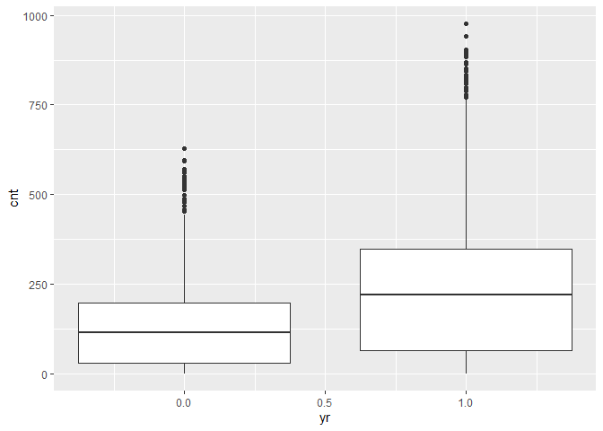
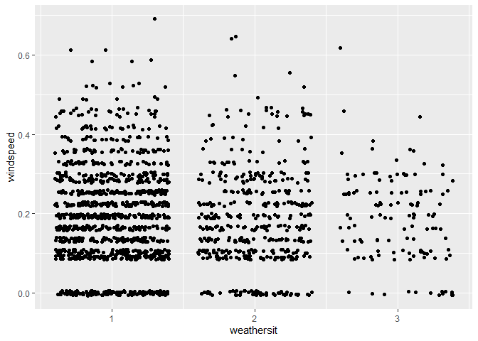
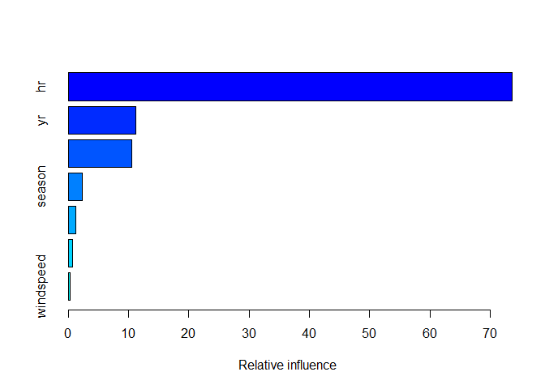

Thursday
================
Shih-Ni Prim
2020-10-16

## Introduction

Now we take a look at Thursday’s analysis. This dataset contains
information about [bike
sharing](https://archive.ics.uci.edu/ml/datasets/Bike+Sharing+Dataset).
We have a variety of predictors, including hours, temperature, humidity,
weekday, holiday/workday or not, etc. In our analysis, We will use two
statistical learning models–regression tree and boosted tree–to predict
the count of total rental bikes `cnt`.

## Setting the Value for the Parameter

Since the current analysis is on Thursday, we first find the
corresponding value for it.

``` r
set.seed(7777)
i <- 0:6
dayz <- c("Sunday", "Monday", "Tuesday", "Wednesday", "Thursday", "Friday", "Saturday")
df <- as.data.frame(cbind(i, dayz))
weekdayNum <- df$i[df$dayz == params$weekday]
print(weekdayNum)
```

    ## [1] 4
    ## Levels: 0 1 2 3 4 5 6

## Data

Now we read in the data. Two datasets are listed on [the
link](https://archive.ics.uci.edu/ml/datasets/Bike+Sharing+Dataset), one
including the `hr` variable, and one treating each day as one
observation and thus not including the `hr` variable. Since hours–the
time in the day–should be a meaningful predictor for the number of bike
rentals, we use the dataset with the `hr` variable

``` r
bikes <- read_csv("Bike-Sharing-Dataset/hour.csv")
```

    ## Parsed with column specification:
    ## cols(
    ##   instant = col_double(),
    ##   dteday = col_date(format = ""),
    ##   season = col_double(),
    ##   yr = col_double(),
    ##   mnth = col_double(),
    ##   hr = col_double(),
    ##   holiday = col_double(),
    ##   weekday = col_double(),
    ##   workingday = col_double(),
    ##   weathersit = col_double(),
    ##   temp = col_double(),
    ##   atemp = col_double(),
    ##   hum = col_double(),
    ##   windspeed = col_double(),
    ##   casual = col_double(),
    ##   registered = col_double(),
    ##   cnt = col_double()
    ## )

``` r
# head(bikes)
analysis <- bikes %>% filter(weekday == weekdayNum) %>% select(-casual, -registered) %>% select(dteday, weekday, everything()) 
# head(analysis)
```

## Splitting Data

We first split up the data into two sets: training and test sets. The
training set has about 70% of the data, and the test set has about 30%.
Splitting up the data is important, because we want to test the model on
a set that is not used in training, otherwise we risk overfitting.

``` r
train <- sample(1:nrow(analysis), size = nrow(analysis)*0.7)
test <- setdiff(1:nrow(analysis), train)

bikeTrain <- analysis[train,]
bikeTest <- analysis[test,]
```

## Summaries and Exploratory Data Analysis

To decide which variables to include in our models, we first take a
quick look at the data. We can look at summaries of numerical variables.

``` r
summary(bikeTrain)
```

    ##      dteday              weekday     instant          season    
    ##  Min.   :2011-01-06   Min.   :4   Min.   :  116   Min.   :1.00  
    ##  1st Qu.:2011-07-07   1st Qu.:4   1st Qu.: 4396   1st Qu.:2.00  
    ##  Median :2011-12-29   Median :4   Median : 8584   Median :3.00  
    ##  Mean   :2011-12-31   Mean   :4   Mean   : 8640   Mean   :2.51  
    ##  3rd Qu.:2012-06-28   3rd Qu.:4   3rd Qu.:12951   3rd Qu.:3.00  
    ##  Max.   :2012-12-27   Max.   :4   Max.   :17283   Max.   :4.00  
    ##        yr              mnth              hr           holiday       
    ##  Min.   :0.0000   Min.   : 1.000   Min.   : 0.00   Min.   :0.00000  
    ##  1st Qu.:0.0000   1st Qu.: 4.000   1st Qu.: 6.00   1st Qu.:0.00000  
    ##  Median :0.0000   Median : 7.000   Median :11.00   Median :0.00000  
    ##  Mean   :0.4945   Mean   : 6.574   Mean   :11.51   Mean   :0.01793  
    ##  3rd Qu.:1.0000   3rd Qu.: 9.000   3rd Qu.:17.00   3rd Qu.:0.00000  
    ##  Max.   :1.0000   Max.   :12.000   Max.   :23.00   Max.   :1.00000  
    ##    workingday       weathersit         temp            atemp       
    ##  Min.   :0.0000   Min.   :1.000   Min.   :0.1000   Min.   :0.0758  
    ##  1st Qu.:1.0000   1st Qu.:1.000   1st Qu.:0.3400   1st Qu.:0.3333  
    ##  Median :1.0000   Median :1.000   Median :0.5200   Median :0.5000  
    ##  Mean   :0.9821   Mean   :1.408   Mean   :0.5104   Mean   :0.4879  
    ##  3rd Qu.:1.0000   3rd Qu.:2.000   3rd Qu.:0.6600   3rd Qu.:0.6212  
    ##  Max.   :1.0000   Max.   :3.000   Max.   :0.9400   Max.   :0.9242  
    ##       hum           windspeed           cnt       
    ##  Min.   :0.0000   Min.   :0.0000   Min.   :  1.0  
    ##  1st Qu.:0.4700   1st Qu.:0.1045   1st Qu.: 44.0  
    ##  Median :0.6100   Median :0.1940   Median :158.0  
    ##  Mean   :0.6107   Mean   :0.1935   Mean   :197.8  
    ##  3rd Qu.:0.7700   3rd Qu.:0.2836   3rd Qu.:277.0  
    ##  Max.   :1.0000   Max.   :0.6866   Max.   :976.0

Below we look at three plots. The first plot shows the histogram of bike
rentals (`cnt`) on Thursday. The second plot shows that `cnt` does vary
in different hours. The third plot shows that `cnt` varies between the
two years. So we know we should keep `hr` and `yr` as
    predictors.

``` r
ggplot(bikeTrain, mapping = aes(x = cnt)) + geom_histogram()
```

    ## `stat_bin()` using `bins = 30`. Pick better value with `binwidth`.

<!-- -->

``` r
ggplot(bikeTrain, aes(x = hr, y = cnt)) + geom_point() + geom_jitter()
```

<!-- -->

``` r
ggplot(bikeTrain, aes(x = yr, y = cnt)) + geom_boxplot(aes(group = yr))
```

<!-- -->

Next we look at correlations of different variables. Weather and
windspeed do not seem correlate, so we will keep both `weathersit` and
`windspeed`.

``` r
ggplot(bikeTrain, aes(x = weathersit, y = windspeed)) + geom_jitter()
```

<!-- -->

Several pairs of variables seem highly correlated–`season` and `mnth`,
`holiday` and `workingday`–so we’ll remove one from each pair.

``` r
cor(bikeTrain$season, bikeTrain$mnth)
```

    ## [1] 0.8203305

``` r
cor(bikeTrain$holiday, bikeTrain$workingday)
```

    ## [1] -1

``` r
cor(bikeTrain$temp, bikeTrain$atemp)
```

    ## [1] 0.9910297

The variance of `workingday` and `holiday` are too small and probably
not good predictors.

``` r
var(bikeTrain$holiday)
```

    ## [1] 0.01761816

``` r
var(bikeTrain$workingday)
```

    ## [1] 0.01761816

Also, `instant` and `dteday` are for record-keeping. Thus, we decide to
keep the following variables as the predictors: `season`, `yr`, `hr`,
`weathersit`, `atemp`, `hum`, and
`windspeed`.

``` r
bikeTrain <- select(bikeTrain, season, yr, hr, weathersit, atemp, hum, windspeed, cnt)
bikeTest <- select(bikeTest, season, yr, hr, weathersit, atemp, hum, windspeed, cnt)
```

## Fitting models

Now we have a final training set and have chosen the predictors, we can
use two models–regression tree and boosted tree–to fit the training
data.

### Regression tree

A regression tree is one of the tree based methods for supervised
learning with the goal of predicting a continuous response. It splits up
predictor space into different regions, and the prediction of each
region is often the mean of observations in that region.

For regression tree, we use the `caret` package and apply the
leave-one-out cross validation method (thus the argument `method =
"LOOCV"`). We set the `tuneLength` as 10 and let the model chooses the
best model automatically.

``` r
modelLookup("rpart")

bikeTree <- train(cnt ~ ., data = bikeTrain, method = "rpart", trControl = trainControl(method = "LOOCV"), tuneGrid = expand.grid(cp = seq(0.01, 0.02, 0.001)))
```

Below we can see the final model; the resulting RMSE, Rsquared, and MAE
of different cp; and a plot that shows the relationship between cp and
RMSE.

``` r
bikeTree$finalModel
```

    ## n= 1729 
    ## 
    ## node), split, n, deviance, yval
    ##       * denotes terminal node
    ## 
    ##   1) root 1729 61651110.0 197.75940  
    ##     2) hr< 6.5 494   833934.4  30.82794 *
    ##     3) hr>=6.5 1235 41544970.0 264.53200  
    ##       6) yr< 0.5 618  9080075.0 188.99510  
    ##        12) atemp< 0.44695 257  2069753.0 128.89880 *
    ##        13) atemp>=0.44695 361  5421372.0 231.77840  
    ##          26) hr< 15.5 194  1263195.0 188.01550  
    ##            52) hr>=8.5 163   294056.8 161.11660 *
    ##            53) hr< 8.5 31   231069.7 329.45160 *
    ##          27) hr>=15.5 167  3355011.0 282.61680  
    ##            54) hr>=20.5 52   140762.7 153.78850 *
    ##            55) hr< 20.5 115  1960979.0 340.86960 *
    ##       7) yr>=0.5 617 25406800.0 340.19120  
    ##        14) hr>=20.5 106   812800.7 185.63210 *
    ##        15) hr< 20.5 511 21536540.0 372.25240  
    ##          30) hr< 16.5 362  8087357.0 299.96960  
    ##            60) hr>=8.5 291  2247388.0 249.26120 *
    ##            61) hr< 8.5 71  2024887.0 507.80280  
    ##             122) hr< 7.5 34   496272.5 385.47060 *
    ##             123) hr>=7.5 37   552238.3 620.21620 *
    ##          31) hr>=16.5 149  6962641.0 547.86580  
    ##            62) atemp< 0.47725 50  1219650.0 349.92000 *
    ##            63) atemp>=0.47725 99  2794407.0 647.83840  
    ##             126) hr>=18.5 44   343906.4 495.88640 *
    ##             127) hr< 18.5 55   621819.2 769.40000 *

``` r
bikeTree
```

    ## CART 
    ## 
    ## 1729 samples
    ##    7 predictor
    ## 
    ## No pre-processing
    ## Resampling: Leave-One-Out Cross-Validation 
    ## Summary of sample sizes: 1728, 1728, 1728, 1728, 1728, 1728, ... 
    ## Resampling results across tuning parameters:
    ## 
    ##   cp     RMSE       Rsquared   MAE     
    ##   0.010   88.47565  0.7805332  62.17621
    ##   0.011   89.10008  0.7774511  62.41517
    ##   0.012   91.33285  0.7661725  64.65007
    ##   0.013   90.83635  0.7686618  63.91590
    ##   0.014   91.08441  0.7673985  64.02656
    ##   0.015   92.26546  0.7614277  64.41892
    ##   0.016   94.78876  0.7483165  66.39899
    ##   0.017  100.26266  0.7183485  71.09874
    ##   0.018   99.71825  0.7213088  70.90109
    ##   0.019  102.74885  0.7042953  71.86475
    ##   0.020  102.74885  0.7042953  71.86475
    ## 
    ## RMSE was used to select the optimal model using the smallest value.
    ## The final value used for the model was cp = 0.01.

``` r
plot(bikeTree)
```

<!-- -->

Finally we use the model to predict `cnt` on the test data and calculate
RMSE to check the fit of the model.

``` r
predTree <- predict(bikeTree, newdata = bikeTest)
treeResult <- postResample(predTree, bikeTest$cnt)
```

### Boosted Tree

A boosted tree is one of the ensemble learning methods, in which the
tree grows sequentially. Each subsequent tree is combined into the
previous model to produce a modified model. The predictions are updated
as the tree grows.

We again use `caret` package and set the method as `gbm`. We use
repeated cross validation (`repeatedcv`) and set the `tuneLength` as 10
and let the model chooses the best model automatically.

``` r
modelLookup("gbm")

grid <- expand.grid(n.trees = c(50, 100, 150), interaction.depth = 1:4, shrinkage = c(0.1, 0.01), n.minobsinnode = c(10, 15, 20))

boostedBike <- train(cnt ~  season + yr + hr + weathersit + atemp + hum + windspeed, data = bikeTrain, method = "gbm", preProcess = c("center", "scale"), trControl = trainControl(method = "repeatedcv", number = 10, repeats = 3), tuneGrid = grid, verbose = FALSE)
```

Below we can see some information about the final model, the predictors
chosen and their importance, and a plot that shows how RMSE changes with
different numbers of boosting iterations and tree depths.

``` r
boostedBike$finalModel
```

    ## A gradient boosted model with gaussian loss function.
    ## 150 iterations were performed.
    ## There were 7 predictors of which 7 had non-zero influence.

``` r
summary(boostedBike)
```

<!-- -->

``` r
plot(boostedBike)
```

<!-- -->

Finally, we use the model to predict `cnt` on the test data and
calculate RMSE to check the fit of the
model.

``` r
predBoostedBike <- predict(boostedBike, newdata = select(bikeTest, -cnt))
boostedResult <- postResample(predBoostedBike, bikeTest$cnt)
```

### Comparison

We can put the testing RMSE from the two models together for comparison.

``` r
comparison <- data.frame(rbind(t(treeResult), t(boostedResult)))
colnames(comparison) <- c("RMSE", "Rsquared", "MAE")
rownames(comparison) <- c("Regression Tree", "Boosted Tree")
knitr::kable(comparison)
```

|                 |     RMSE |  Rsquared |      MAE |
| --------------- | -------: | --------: | -------: |
| Regression Tree | 88.51060 | 0.7737665 | 62.85053 |
| Boosted Tree    | 51.17239 | 0.9243865 | 30.14302 |

### Final Model

``` r
# a function to generate the name of the best model
model <- function(x, y){
  xscore <- 0
  if (x[[1]] < y[[1]]) {
    xscore = xscore + 1
  }
  if (x[[2]] > y[[2]]){
    xscore = xscore + 1
  }
  if (x[[3]] < y[[3]]){
    xscore = xscore + 1
  }
  if (xscore == 2 || xscore == 3){
    final <- c("regression tree")
  } else {
    final <- c("boosted tree")
  }
  return(final)
}
# model(treeResult, boostedResult)
```

From the output, we can conclude that the boosted tree is the better
model for Thursday data, because it has better performance in terms of
RMSE, Rsquared, and MAE.

### Linear regression model

I fit the multiple linear regression model for the predictors `season`,
`yr`, `hr`, `weathersit`, `atemp`, `hum`, `windspeed`, and response is
`cnt`.

``` r
mlrFit <- lm(cnt~., data = bikeTrain)
mlr <- train(cnt ~ ., data = bikeTrain, method = "lm",
preProcess = c("center", "scale"),
trControl = trainControl(method = "cv", number = 10))
mlr
```

    ## Linear Regression 
    ## 
    ## 1729 samples
    ##    7 predictor
    ## 
    ## Pre-processing: centered (7), scaled (7) 
    ## Resampling: Cross-Validated (10 fold) 
    ## Summary of sample sizes: 1557, 1555, 1556, 1557, 1556, 1555, ... 
    ## Resampling results:
    ## 
    ##   RMSE      Rsquared   MAE     
    ##   151.2251  0.3605115  110.0092
    ## 
    ## Tuning parameter 'intercept' was held constant at a value of TRUE

``` r
mlr$results
pred <- predict(mlr, newdata = bikeTest)
pred_mlr <- postResample(pred, obs = bikeTest$cnt)
pred_mlr
```

    ##        RMSE    Rsquared         MAE 
    ## 152.7334738   0.3265641 112.3522014

We can compare both linear regression model and nonlinear model, choose
the one with comparatively smaller RMSE, smaller MAE and bigger
Rsquared.
