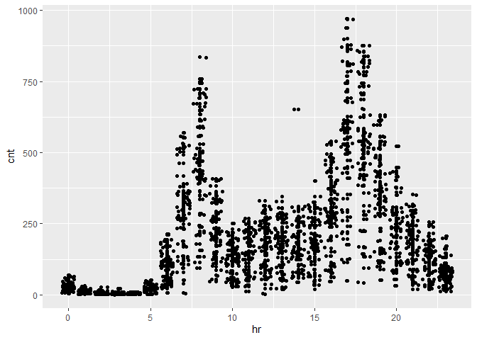
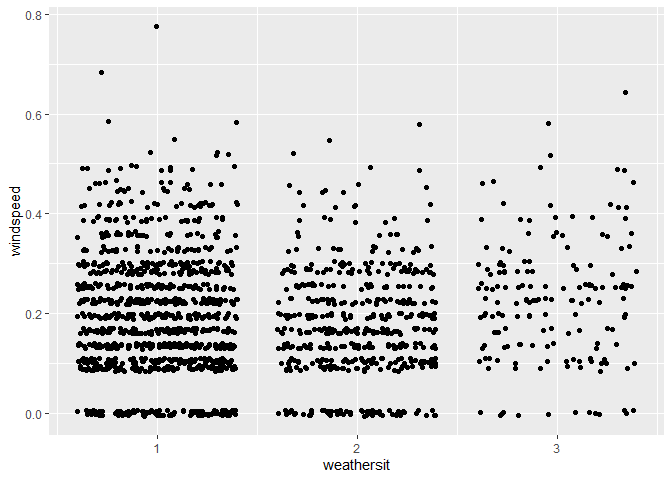

Tuesday
================
Shih-Ni Prim
2020-10-16

  - [Introduction](#introduction)
  - [Setting the Value for the
    Parameter](#setting-the-value-for-the-parameter)
  - [Data](#data)
  - [Splitting Data](#splitting-data)
  - [Summaries and Exploratory Data
    Analysis](#summaries-and-exploratory-data-analysis)
  - [Fitting models](#fitting-models)
      - [Regression tree](#regression-tree)
      - [Boosted Tree](#boosted-tree)
      - [Comparison](#comparison)
      - [Final Model](#final-model)

## Introduction

Now we take a look at Tuesday’s analysis. This dataset contains
information about [bike
sharing](https://archive.ics.uci.edu/ml/datasets/Bike+Sharing+Dataset).
We have a variety of predictors, including hours, temperature, humidity,
weekday, holiday/workday or not, etc. In our analysis, We will use two
statistical learning models–regression tree and boosted tree–to predict
the count of total rental bikes `cnt`.

## Setting the Value for the Parameter

Since the current analysis is on Tuesday, we first find the
corresponding value for it.

``` r
set.seed(7777)
i <- 0:6
dayz <- c("Sunday", "Monday", "Tuesday", "Wednesday", "Thursday", "Friday", "Saturday")
df <- as.data.frame(cbind(i, dayz))
weekdayNum <- df$i[df$dayz == params$weekday]
print(weekdayNum)
```

    ## [1] "2"

## Data

Now we read in the data. Two datasets are listed on [the
link](https://archive.ics.uci.edu/ml/datasets/Bike+Sharing+Dataset), one
including the `hr` variable, and one treating each day as one
observation and thus not including the `hr` variable. Since hours–the
time in the day–should be a meaningful predictor for the number of bike
rentals, we use the dataset with the `hr` variable

``` r
bikes <- read_csv("../Bike-Sharing-Dataset/hour.csv")
```

    ## Parsed with column specification:
    ## cols(
    ##   instant = col_double(),
    ##   dteday = col_date(format = ""),
    ##   season = col_double(),
    ##   yr = col_double(),
    ##   mnth = col_double(),
    ##   hr = col_double(),
    ##   holiday = col_double(),
    ##   weekday = col_double(),
    ##   workingday = col_double(),
    ##   weathersit = col_double(),
    ##   temp = col_double(),
    ##   atemp = col_double(),
    ##   hum = col_double(),
    ##   windspeed = col_double(),
    ##   casual = col_double(),
    ##   registered = col_double(),
    ##   cnt = col_double()
    ## )

``` r
# head(bikes)
analysis <- bikes %>% filter(weekday == weekdayNum) %>% select(-casual, -registered) %>% select(dteday, weekday, everything()) 
# head(analysis)
```

## Splitting Data

We first split up the data into two sets: training and test sets. The
training set has about 70% of the data, and the test set has about 30%.
Splitting up the data is important, because we want to test the model on
a set that is not used in training, otherwise we risk overfitting.

``` r
train <- sample(1:nrow(analysis), size = nrow(analysis)*0.7)
test <- setdiff(1:nrow(analysis), train)

bikeTrain <- analysis[train,]
bikeTest <- analysis[test,]
```

## Summaries and Exploratory Data Analysis

To decide which variables to include in our models, we first take a
quick look at the data. We can look at summaries of numerical variables.

``` r
summary(bikeTrain)
```

    ##      dteday              weekday     instant          season            yr        
    ##  Min.   :2011-01-04   Min.   :2   Min.   :   70   Min.   :1.000   Min.   :0.0000  
    ##  1st Qu.:2011-07-05   1st Qu.:2   1st Qu.: 4351   1st Qu.:2.000   1st Qu.:0.0000  
    ##  Median :2011-12-27   Median :2   Median : 8540   Median :3.000   Median :0.0000  
    ##  Mean   :2011-12-29   Mean   :2   Mean   : 8612   Mean   :2.533   Mean   :0.4956  
    ##  3rd Qu.:2012-06-26   3rd Qu.:2   3rd Qu.:12907   3rd Qu.:3.000   3rd Qu.:1.0000  
    ##  Max.   :2012-12-25   Max.   :2   Max.   :17235   Max.   :4.000   Max.   :1.0000  
    ##       mnth              hr          holiday           workingday       weathersit   
    ##  Min.   : 1.000   Min.   : 0.0   Min.   :0.000000   Min.   :0.0000   Min.   :1.000  
    ##  1st Qu.: 4.000   1st Qu.: 6.0   1st Qu.:0.000000   1st Qu.:1.0000   1st Qu.:1.000  
    ##  Median : 7.000   Median :12.0   Median :0.000000   Median :1.0000   Median :1.000  
    ##  Mean   : 6.513   Mean   :11.6   Mean   :0.008154   Mean   :0.9918   Mean   :1.483  
    ##  3rd Qu.: 9.000   3rd Qu.:18.0   3rd Qu.:0.000000   3rd Qu.:1.0000   3rd Qu.:2.000  
    ##  Max.   :12.000   Max.   :23.0   Max.   :1.000000   Max.   :1.0000   Max.   :3.000  
    ##       temp            atemp             hum           windspeed           cnt       
    ##  Min.   :0.1000   Min.   :0.0758   Min.   :0.1600   Min.   :0.0000   Min.   :  1.0  
    ##  1st Qu.:0.3600   1st Qu.:0.3485   1st Qu.:0.4900   1st Qu.:0.1045   1st Qu.: 35.0  
    ##  Median :0.5400   Median :0.5152   Median :0.6600   Median :0.1940   Median :144.0  
    ##  Mean   :0.5115   Mean   :0.4898   Mean   :0.6417   Mean   :0.1933   Mean   :192.7  
    ##  3rd Qu.:0.6600   3rd Qu.:0.6212   3rd Qu.:0.8100   3rd Qu.:0.2836   3rd Qu.:275.0  
    ##  Max.   :0.9400   Max.   :0.8485   Max.   :1.0000   Max.   :0.7761   Max.   :970.0

Below we look at three plots. The first plot shows the histogram of bike
rentals (`cnt`) on Tuesday. The second plot shows that `cnt` does vary
in different hours. The third plot shows that `cnt` varies between the
two years. So we know we should keep `hr` and `yr` as predictors.

``` r
ggplot(bikeTrain, mapping = aes(x = cnt)) + geom_histogram()
```

    ## `stat_bin()` using `bins = 30`. Pick better value with `binwidth`.

<!-- -->

``` r
ggplot(bikeTrain, aes(x = hr, y = cnt)) + geom_point() + geom_jitter()
```

<!-- -->

``` r
ggplot(bikeTrain, aes(x = yr, y = cnt)) + geom_boxplot(aes(group = yr))
```

<!-- -->

Next we look at correlations of different variables. Weather and
windspeed do not seem correlate, so we will keep both `weathersit` and
`windspeed`.

``` r
ggplot(bikeTrain, aes(x = weathersit, y = windspeed)) + geom_jitter()
```

<!-- -->

Several pairs of variables seem highly correlated–`season` and `mnth`,
`holiday` and `workingday`–so we’ll remove one from each pair.

``` r
cor(bikeTrain$season, bikeTrain$mnth)
```

    ## [1] 0.8843931

``` r
cor(bikeTrain$holiday, bikeTrain$workingday)
```

    ## [1] -1

``` r
cor(bikeTrain$temp, bikeTrain$atemp)
```

    ## [1] 0.9925321

The variance of `workingday` and `holiday` are too small and probably
not good predictors.

``` r
var(bikeTrain$holiday)
```

    ## [1] 0.008091986

``` r
var(bikeTrain$workingday)
```

    ## [1] 0.008091986

Also, `instant` and `dteday` are for record-keeping. Thus, we decide to
keep the following variables as the predictors: `season`, `yr`, `hr`,
`weathersit`, `atemp`, `hum`, and `windspeed`.

``` r
bikeTrain <- select(bikeTrain, season, yr, hr, weathersit, atemp, hum, windspeed, cnt)
bikeTest <- select(bikeTest, season, yr, hr, weathersit, atemp, hum, windspeed, cnt)
```

## Fitting models

Now we have a final training set and have chosen the predictors, we can
use two models–regression tree and boosted tree–to fit the training
data.

### Regression tree

A regression tree is one of the tree based methods for supervised
learning with the goal of predicting a continuous response. It splits up
predictor space into different regions, and the prediction of each
region is often the mean of observations in that region.

For regression tree, we use the `caret` package and apply the
leave-one-out cross validation method (thus the argument `method =
"LOOCV"`). We set the `tuneLength` as 10 and let the model chooses the
best model automatically.

``` r
modelLookup("rpart")

bikeTree <- train(cnt ~ ., data = bikeTrain, method = "rpart", trControl = trainControl(method = "LOOCV"), tuneGrid = expand.grid(cp = seq(0.01, 0.02, 0.001)))
```

Below we can see the final model; the resulting RMSE, Rsquared, and MAE
of different cp; and a plot that shows the relationship between cp and
RMSE.

``` r
bikeTree$finalModel
```

    ## n= 1717 
    ## 
    ## node), split, n, deviance, yval
    ##       * denotes terminal node
    ## 
    ##   1) root 1717 63218090.0 192.68490  
    ##     2) hr< 6.5 489   717922.6  25.94683 *
    ##     3) hr>=6.5 1228 43491550.0 259.08140  
    ##       6) atemp< 0.41665 395  7085909.0 166.26580  
    ##        12) yr< 0.5 210  1567986.0 114.32860 *
    ##        13) yr>=0.5 185  4308432.0 225.22160  
    ##          26) hr>=8.5 161  2982842.0 202.14290 *
    ##          27) hr< 8.5 24   664575.0 380.04170 *
    ##       7) atemp>=0.41665 833 31389240.0 303.09360  
    ##        14) hr>=20.5 137   700354.2 158.47450 *
    ##        15) hr< 20.5 696 27259560.0 331.56030  
    ##          30) hr< 16.5 494 10001030.0 259.59510  
    ##            60) hr>=8.5 405  3845570.0 218.93090  
    ##             120) hr< 15.5 343  2270075.0 199.02040  
    ##               240) yr< 0.5 169   695013.8 154.66270 *
    ##               241) yr>=0.5 174   919566.1 242.10340 *
    ##             121) hr>=15.5 62   687276.6 329.08060 *
    ##            61) hr< 8.5 89  2438240.0 444.64040  
    ##             122) yr< 0.5 47   374351.7 358.51060 *
    ##             123) yr>=0.5 42  1325057.0 541.02380 *
    ##          31) hr>=16.5 202  8443380.0 507.55450  
    ##            62) hr>=18.5 95  1646665.0 365.44210 *
    ##            63) hr< 18.5 107  3174661.0 633.72900  
    ##             126) yr< 0.5 48   430608.0 501.14580 *
    ##             127) yr>=0.5 59  1213848.0 741.59320 *

``` r
bikeTree
```

    ## CART 
    ## 
    ## 1717 samples
    ##    7 predictor
    ## 
    ## No pre-processing
    ## Resampling: Leave-One-Out Cross-Validation 
    ## Summary of sample sizes: 1716, 1716, 1716, 1716, 1716, 1716, ... 
    ## Resampling results across tuning parameters:
    ## 
    ##   cp     RMSE       Rsquared   MAE     
    ##   0.010   99.37055  0.7322410  67.25820
    ##   0.011  102.03713  0.7174872  70.80159
    ##   0.012  103.40609  0.7099067  71.30860
    ##   0.013  101.45779  0.7205748  70.50711
    ##   0.014  103.34339  0.7101881  71.77083
    ##   0.015  100.53422  0.7255055  69.56562
    ##   0.016  100.53422  0.7255055  69.56562
    ##   0.017  100.53422  0.7255055  69.56562
    ##   0.018  101.45490  0.7204612  69.77381
    ##   0.019  107.90666  0.6841045  73.78614
    ##   0.020  105.48874  0.6978079  72.82079
    ## 
    ## RMSE was used to select the optimal model using the smallest value.
    ## The final value used for the model was cp = 0.01.

``` r
plot(bikeTree)
```

<!-- -->

Finally we use the model to predict `cnt` on the test data and calculate
RMSE to check the fit of the model.

``` r
predTree <- predict(bikeTree, newdata = bikeTest)
treeResult <- postResample(predTree, bikeTest$cnt)
```

### Boosted Tree

A boosted tree is one of the ensemble learning methods, in which the
tree grows sequentially. Each subsequent tree is combined into the
previous model to produce a modified model. The predictions are updated
as the tree grows.

We again use `caret` package and set the method as `gbm`. We use
repeated cross validation (`repeatedcv`) and set the `tuneLength` as 10
and let the model chooses the best model automatically.

``` r
modelLookup("gbm")

grid <- expand.grid(n.trees = c(50, 100, 150), interaction.depth = 1:4, shrinkage = c(0.1, 0.01), n.minobsinnode = c(10, 15, 20))

boostedBike <- train(cnt ~  season + yr + hr + weathersit + atemp + hum + windspeed, data = bikeTrain, method = "gbm", preProcess = c("center", "scale"), trControl = trainControl(method = "repeatedcv", number = 10, repeats = 3), tuneGrid = grid, verbose = FALSE)
```

Below we can see some information about the final model, the predictors
chosen and their importance, and a plot that shows how RMSE changes with
different numbers of boosting iterations and tree depths.

``` r
boostedBike$finalModel
```

    ## A gradient boosted model with gaussian loss function.
    ## 150 iterations were performed.
    ## There were 7 predictors of which 7 had non-zero influence.

``` r
summary(boostedBike)
```

<!-- -->

``` r
plot(boostedBike)
```

<!-- -->

Finally, we use the model to predict `cnt` on the test data and
calculate RMSE to check the fit of the model.

``` r
predBoostedBike <- predict(boostedBike, newdata = select(bikeTest, -cnt))
boostedResult <- postResample(predBoostedBike, bikeTest$cnt)
```

### Comparison

We can put the testing RMSE from the two models together for comparison.

``` r
comparison <- data.frame(rbind(t(treeResult), t(boostedResult)))
colnames(comparison) <- c("RMSE", "Rsquared", "MAE")
rownames(comparison) <- c("Regression Tree", "Boosted Tree")
knitr::kable(comparison)
```

|                 |     RMSE |  Rsquared |      MAE |
| :-------------- | -------: | --------: | -------: |
| Regression Tree | 88.92288 | 0.7534495 | 62.07661 |
| Boosted Tree    | 44.83874 | 0.9364741 | 28.05756 |

### Final Model

``` r
# a function to generate the name of the best model
model <- function(x, y){
  xscore <- 0
  if (x[[1]] < y[[1]]) {
    xscore = xscore + 1
  }
  if (x[[2]] > y[[2]]){
    xscore = xscore + 1
  }
  if (x[[3]] < y[[3]]){
    xscore = xscore + 1
  }
  if (xscore == 2 || xscore == 3){
    final <- c("regression tree")
  } else {
    final <- c("boosted tree")
  }
  return(final)
}
# model(treeResult, boostedResult)
```

From the output, we can conclude that the boosted tree is the better
model for Tuesday data, because it has better performance in terms of
RMSE, Rsquared, and MAE.
