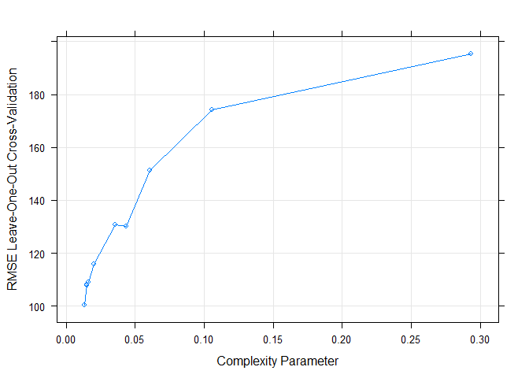
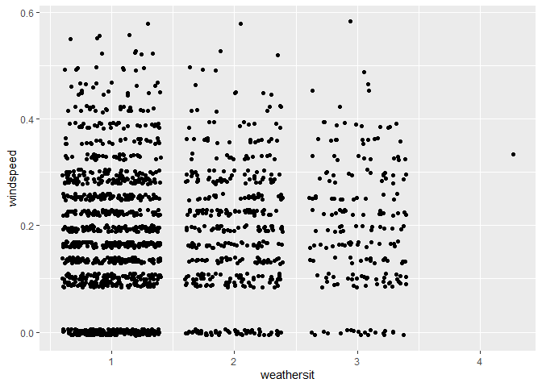
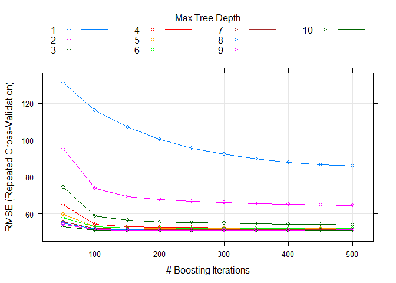

Wednesday
================
Shih-Ni Prim
2020-10-11

  - [Introduction](#introduction)
  - [Setting the Value for the
    Parameter](#setting-the-value-for-the-parameter)
  - [Data](#data)
  - [Splitting Data](#splitting-data)
  - [Summaries and Exploratory Data
    Analysis](#summaries-and-exploratory-data-analysis)
  - [Fitting models](#fitting-models)
      - [Regression tree](#regression-tree)
      - [Boosted Tree](#boosted-tree)
      - [Comparison](#comparison)
      - [Final Model](#final-model)

## Introduction

Now we take a look at Wednesday’s analysis. This dataset contains
information about [bike
sharing](https://archive.ics.uci.edu/ml/datasets/Bike+Sharing+Dataset).
We have a variety of predictors, including hours, temperature, humidity,
weekday, holiday/workday or not, etc. In our analysis, We will use two
statistical learning models–regression tree and boosted tree–to predict
the count of total rental bikes `cnt`.

## Setting the Value for the Parameter

Since the current analysis is on Wednesday, we first find the
corresponding value for it.

``` r
set.seed(7777)
i <- 0:6
dayz <- c("Sunday", "Monday", "Tuesday", "Wednesday", "Thursday", "Friday", "Saturday")
df <- as.data.frame(cbind(i, dayz))
weekdayNum <- df$i[df$dayz == params$weekday]
print(weekdayNum)
```

    ## [1] "3"

## Data

Now we read in the data. Two datasets are listed on [the
link](https://archive.ics.uci.edu/ml/datasets/Bike+Sharing+Dataset), one
including the `hr` variable, and one treating each day as one
observation and thus not including the `hr` variable. Since hours–the
time in the day–should be a meaningful predictor for the number of bike
rentals, we use the dataset with the `hr` variable

``` r
bikes <- read_csv("../Bike-Sharing-Dataset/hour.csv")
```

    ## Parsed with column specification:
    ## cols(
    ##   instant = col_double(),
    ##   dteday = col_date(format = ""),
    ##   season = col_double(),
    ##   yr = col_double(),
    ##   mnth = col_double(),
    ##   hr = col_double(),
    ##   holiday = col_double(),
    ##   weekday = col_double(),
    ##   workingday = col_double(),
    ##   weathersit = col_double(),
    ##   temp = col_double(),
    ##   atemp = col_double(),
    ##   hum = col_double(),
    ##   windspeed = col_double(),
    ##   casual = col_double(),
    ##   registered = col_double(),
    ##   cnt = col_double()
    ## )

``` r
# head(bikes)
analysis <- bikes %>% filter(weekday == weekdayNum) %>% select(-casual, -registered) %>% select(dteday, weekday, everything()) 
# head(analysis)
```

## Splitting Data

We first split up the data into two sets: training and test sets. The
training set has about 70% of the data, and the test set has about 30%.
Splitting up the data is important, because we want to test the model on
a set that is not used in training, otherwise we risk overfitting.

``` r
train <- sample(1:nrow(analysis), size = nrow(analysis)*0.7)
test <- setdiff(1:nrow(analysis), train)

bikeTrain <- analysis[train,]
bikeTest <- analysis[test,]
```

## Summaries and Exploratory Data Analysis

To decide which variables to include in our models, we first take a
quick look at the data. We can look at summaries of numerical variables.

``` r
summary(bikeTrain)
```

    ##      dteday              weekday     instant          season            yr        
    ##  Min.   :2011-01-05   Min.   :3   Min.   :   93   Min.   :1.000   Min.   :0.0000  
    ##  1st Qu.:2011-06-29   1st Qu.:3   1st Qu.: 4224   1st Qu.:2.000   1st Qu.:0.0000  
    ##  Median :2011-12-28   Median :3   Median : 8558   Median :3.000   Median :0.0000  
    ##  Mean   :2011-12-29   Mean   :3   Mean   : 8598   Mean   :2.502   Mean   :0.4942  
    ##  3rd Qu.:2012-06-27   3rd Qu.:3   3rd Qu.:12922   3rd Qu.:3.000   3rd Qu.:1.0000  
    ##  Max.   :2012-12-26   Max.   :3   Max.   :17259   Max.   :4.000   Max.   :1.0000  
    ##       mnth             hr           holiday          workingday       weathersit   
    ##  Min.   : 1.00   Min.   : 0.00   Min.   :0.00000   Min.   :0.0000   Min.   :1.000  
    ##  1st Qu.: 4.00   1st Qu.: 6.00   1st Qu.:0.00000   1st Qu.:1.0000   1st Qu.:1.000  
    ##  Median : 7.00   Median :11.00   Median :0.00000   Median :1.0000   Median :1.000  
    ##  Mean   : 6.51   Mean   :11.47   Mean   :0.01039   Mean   :0.9896   Mean   :1.475  
    ##  3rd Qu.: 9.00   3rd Qu.:17.00   3rd Qu.:0.00000   3rd Qu.:1.0000   3rd Qu.:2.000  
    ##  Max.   :12.00   Max.   :23.00   Max.   :1.00000   Max.   :1.0000   Max.   :4.000  
    ##       temp            atemp             hum           windspeed           cnt       
    ##  Min.   :0.0200   Min.   :0.0152   Min.   :0.2000   Min.   :0.0000   Min.   :  1.0  
    ##  1st Qu.:0.3400   1st Qu.:0.3333   1st Qu.:0.4900   1st Qu.:0.1045   1st Qu.: 36.0  
    ##  Median :0.5200   Median :0.5000   Median :0.6500   Median :0.1940   Median :143.5  
    ##  Mean   :0.5093   Mean   :0.4860   Mean   :0.6458   Mean   :0.1880   Mean   :190.5  
    ##  3rd Qu.:0.6600   3rd Qu.:0.6212   3rd Qu.:0.8200   3rd Qu.:0.2836   3rd Qu.:276.2  
    ##  Max.   :0.9400   Max.   :0.8788   Max.   :1.0000   Max.   :0.5821   Max.   :977.0

Below we look at three plots. The first plot shows the histogram of bike
rentals (`cnt`) on Wednesday. The second plot shows that `cnt` does vary
in different hours. The third plot shows that `cnt` varies between the
two years. So we know we should keep `hr` and `yr` as predictors.

``` r
ggplot(bikeTrain, mapping = aes(x = cnt)) + geom_histogram()
```

    ## `stat_bin()` using `bins = 30`. Pick better value with `binwidth`.

<!-- -->

``` r
ggplot(bikeTrain, aes(x = hr, y = cnt)) + geom_point() + geom_jitter()
```

<!-- -->

``` r
ggplot(bikeTrain, aes(x = yr, y = cnt)) + geom_boxplot(aes(group = yr))
```

<!-- -->

Next we look at correlations of different variables. Weather and
windspeed do not seem correlate, so we will keep both `weathersit` and
`windspeed`.

``` r
ggplot(bikeTrain, aes(x = weathersit, y = windspeed)) + geom_jitter()
```

<!-- -->

Several pairs of variables seem highly correlated–`season` and `mnth`,
`holiday` and `workingday`–so we’ll remove one from each pair.

``` r
cor(bikeTrain$season, bikeTrain$mnth)
```

    ## [1] 0.8456849

``` r
cor(bikeTrain$holiday, bikeTrain$workingday)
```

    ## [1] -1

``` r
cor(bikeTrain$temp, bikeTrain$atemp)
```

    ## [1] 0.9923651

The variance of `workingday` and `holiday` are too small and probably
not good predictors.

``` r
var(bikeTrain$holiday)
```

    ## [1] 0.01029054

``` r
var(bikeTrain$workingday)
```

    ## [1] 0.01029054

Also, `instant` and `dteday` are for record-keeping. Thus, we decide to
keep the following variables as the predictors: `season`, `yr`, `hr`,
`weathersit`, `atemp`, `hum`, and `windspeed`.

``` r
bikeTrain <- select(bikeTrain, season, yr, hr, weathersit, atemp, hum, windspeed, cnt)
bikeTest <- select(bikeTest, season, yr, hr, weathersit, atemp, hum, windspeed, cnt)
```

## Fitting models

Now we have a final training set and have chosen the predictors, we can
use two models–regression tree and boosted tree–to fit the training
data.

### Regression tree

A regression tree is one of the tree based methods for supervised
learning with the goal of predicting a continuous response. It splits up
predictor space into different regions, and the prediction of each
region is often the mean of observations in that region.

For regression tree, we use the `caret` package and apply the
leave-one-out cross validation method (thus the argument `method =
"LOOCV"`). We set the `tuneLength` as 10 and let the model chooses the
best model automatically. Below we can see the resulting RMSE, Rsquared,
and MAE of different cp as well as a plot that visualizes this
information.

Finally we use the model to predict `cnt` on the test data and calculate
RMSE to check the fit of the model.

``` r
modelLookup("rpart")

bikeTree <- train(cnt ~ ., data = bikeTrain, method = "rpart", trControl = trainControl(method = "LOOCV"), tuneLength = 10)
bikeTree
```

    ## CART 
    ## 
    ## 1732 samples
    ##    7 predictor
    ## 
    ## No pre-processing
    ## Resampling: Leave-One-Out Cross-Validation 
    ## Summary of sample sizes: 1731, 1731, 1731, 1731, 1731, 1731, ... 
    ## Resampling results across tuning parameters:
    ## 
    ##   cp          RMSE      Rsquared      MAE      
    ##   0.01314124  100.5236  0.7174488544   71.99412
    ##   0.01489909  108.0915  0.6734723184   76.31113
    ##   0.01504213  107.8424  0.6749523137   75.79383
    ##   0.01624795  109.0394  0.6696694242   76.30465
    ##   0.02046554  116.0012  0.6256923859   83.24468
    ##   0.03587910  130.6786  0.5243417987   95.37271
    ##   0.04335305  130.1660  0.5300391899   90.71047
    ##   0.06095952  151.1684  0.3709209677  107.43833
    ##   0.10585748  174.1146  0.1832722325  129.36184
    ##   0.29362144  195.2185  0.0001528175  167.60722
    ## 
    ## RMSE was used to select the optimal model using the smallest value.
    ## The final value used for the model was cp = 0.01314124.

``` r
plot(bikeTree)
```

<!-- -->

``` r
predTree <- predict(bikeTree, newdata = bikeTest)
treeResult <- postResample(predTree, bikeTest$cnt)
```

### Boosted Tree

A boosted tree is one of the ensemble learning methods, in which the
tree grows sequentially. Each subsequent tree is combined into the
previous model to produce a modified model. The predictions are updated
as the tree grows.

We again use `caret` package and set the method as `gbm`. We use
repeated cross validation (`repeatedcv`) and set the `tuneLength` as 10
and let the model chooses the best model automatically. We can then see
the importance of each variable and a plot that shows how RMSE changes
with different numbers of boosting iterations and tree depths.

Finally, we use the model to predict `cnt` on the test data and
calculate RMSE to check the fit of the model.

``` r
modelLookup("gbm")

boostedBike <- train(cnt ~  season + yr + hr + weathersit + atemp + hum + windspeed, data = bikeTrain, method = "gbm", preProcess = c("center", "scale"), trControl = trainControl(method = "repeatedcv", number = 10, repeats = 3), tuneLength = 10, verbose = FALSE)
summary(boostedBike)
```

<!-- -->

``` r
plot(boostedBike)
```

<!-- -->

``` r
predBoostedBike <- predict(boostedBike, newdata = select(bikeTest, -cnt))
boostedResult <- postResample(predBoostedBike, bikeTest$cnt)
```

### Comparison

We can put the testing RMSE from the two models together for comparison.

``` r
comparison <- data.frame(rbind(t(treeResult), t(boostedResult)))
colnames(comparison) <- c("RMSE", "Rsquared", "MAE")
rownames(comparison) <- c("Regression Tree", "Boosted Tree")
knitr::kable(comparison)
```

|                 |    RMSE |  Rsquared |      MAE |
| :-------------- | ------: | --------: | -------: |
| Regression Tree | 99.8865 | 0.7390699 | 69.43440 |
| Boosted Tree    | 49.8292 | 0.9359198 | 30.10361 |

### Final Model

``` r
# a function to generate the name of the best model
model <- function(x, y){
  xscore <- 0
  if (x[[1]] < y[[1]]) {
    xscore = xscore + 1
  }
  if (x[[2]] > y[[2]]){
    xscore = xscore + 1
  }
  if (x[[3]] < y[[3]]){
    xscore = xscore + 1
  }
  if (xscore == 2 || xscore == 3){
    final <- c("regression tree")
  } else {
    final <- c("boosted tree")
  }
  return(final)
}
# model(treeResult, boostedResult)
```

From the output, we can conclude that the boosted tree is the better
model for Wednesday data, because it has better performance in terms of
RMSE, Rsquared, and MAE.
