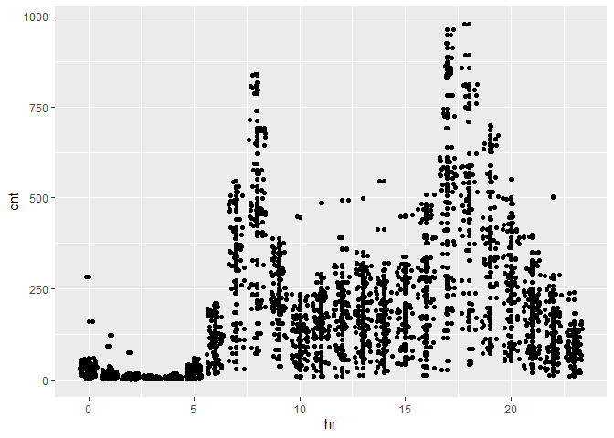
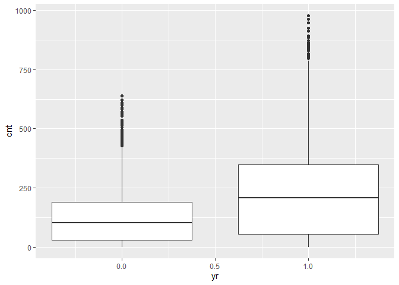
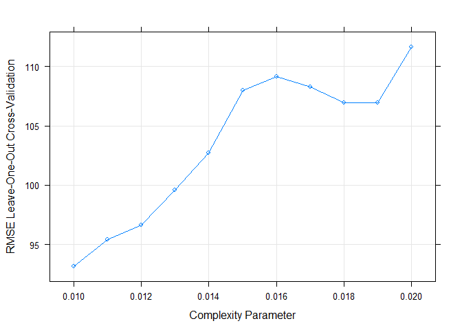
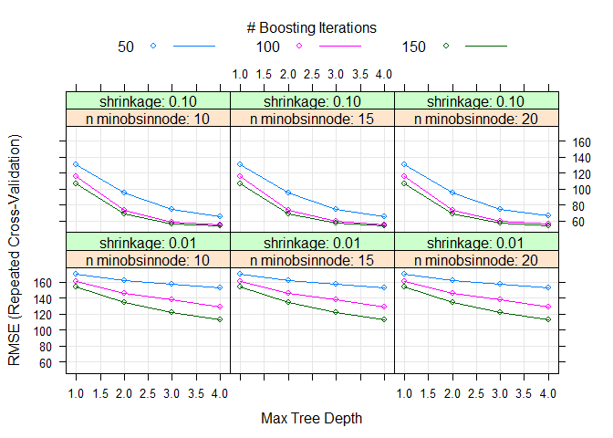

Wednesday
================
Shih-Ni Prim
2020-10-16

  - [Introduction](#introduction)
  - [Setting the Value for the
    Parameter](#setting-the-value-for-the-parameter)
  - [Data](#data)
  - [Splitting Data](#splitting-data)
  - [Summaries and Exploratory Data
    Analysis](#summaries-and-exploratory-data-analysis)
  - [Fitting models](#fitting-models)
      - [Regression tree](#regression-tree)
      - [Boosted Tree](#boosted-tree)
      - [Linear Regression Model](#linear-regression-model)
      - [Comparison](#comparison)
      - [Final Model](#final-model)

## Introduction

Now we take a look at Wednesday’s analysis. This dataset contains
information about [bike
sharing](https://archive.ics.uci.edu/ml/datasets/Bike+Sharing+Dataset).
We have a variety of predictors, including hours, temperature, humidity,
weekday, holiday/workday or not, etc. In our analysis, We will use two
statistical learning models–regression tree and boosted tree–to predict
the count of total rental bikes `cnt`.

## Setting the Value for the Parameter

Since the current analysis is on Wednesday, we first find the
corresponding value for it.

``` r
set.seed(7777)
i <- 0:6
dayz <- c("Sunday", "Monday", "Tuesday", "Wednesday", "Thursday", "Friday", "Saturday")
df <- as.data.frame(cbind(i, dayz))
weekdayNum <- df$i[df$dayz == params$weekday]
print(weekdayNum)
```

    ## [1] "3"

## Data

Now we read in the data. Two datasets are listed on [the
link](https://archive.ics.uci.edu/ml/datasets/Bike+Sharing+Dataset), one
including the `hr` variable, and one treating each day as one
observation and thus not including the `hr` variable. Since hours–the
time in the day–should be a meaningful predictor for the number of bike
rentals, we use the dataset with the `hr` variable

``` r
bikes <- read_csv("Bike-Sharing-Dataset/hour.csv")
```

    ## Parsed with column specification:
    ## cols(
    ##   instant = col_double(),
    ##   dteday = col_date(format = ""),
    ##   season = col_double(),
    ##   yr = col_double(),
    ##   mnth = col_double(),
    ##   hr = col_double(),
    ##   holiday = col_double(),
    ##   weekday = col_double(),
    ##   workingday = col_double(),
    ##   weathersit = col_double(),
    ##   temp = col_double(),
    ##   atemp = col_double(),
    ##   hum = col_double(),
    ##   windspeed = col_double(),
    ##   casual = col_double(),
    ##   registered = col_double(),
    ##   cnt = col_double()
    ## )

``` r
# head(bikes)
analysis <- bikes %>% filter(weekday == weekdayNum) %>% select(-casual, -registered) %>% select(dteday, weekday, everything()) 
# head(analysis)
```

## Splitting Data

We first split up the data into two sets: training and test sets. The
training set has about 70% of the data, and the test set has about 30%.
Splitting up the data is important, because we want to test the model on
a set that is not used in training, otherwise we risk overfitting.

``` r
train <- sample(1:nrow(analysis), size = nrow(analysis)*0.7)
test <- setdiff(1:nrow(analysis), train)

bikeTrain <- analysis[train,]
bikeTest <- analysis[test,]
```

## Summaries and Exploratory Data Analysis

To decide which variables to include in our models, we first take a
quick look at the data. We can look at summaries of numerical variables.

``` r
summary(bikeTrain)
```

    ##      dteday              weekday     instant          season     
    ##  Min.   :2011-01-05   Min.   :3   Min.   :   93   Min.   :1.000  
    ##  1st Qu.:2011-06-29   1st Qu.:3   1st Qu.: 4224   1st Qu.:2.000  
    ##  Median :2011-12-28   Median :3   Median : 8558   Median :3.000  
    ##  Mean   :2011-12-29   Mean   :3   Mean   : 8598   Mean   :2.502  
    ##  3rd Qu.:2012-06-27   3rd Qu.:3   3rd Qu.:12922   3rd Qu.:3.000  
    ##  Max.   :2012-12-26   Max.   :3   Max.   :17259   Max.   :4.000  
    ##        yr              mnth             hr           holiday       
    ##  Min.   :0.0000   Min.   : 1.00   Min.   : 0.00   Min.   :0.00000  
    ##  1st Qu.:0.0000   1st Qu.: 4.00   1st Qu.: 6.00   1st Qu.:0.00000  
    ##  Median :0.0000   Median : 7.00   Median :11.00   Median :0.00000  
    ##  Mean   :0.4942   Mean   : 6.51   Mean   :11.47   Mean   :0.01039  
    ##  3rd Qu.:1.0000   3rd Qu.: 9.00   3rd Qu.:17.00   3rd Qu.:0.00000  
    ##  Max.   :1.0000   Max.   :12.00   Max.   :23.00   Max.   :1.00000  
    ##    workingday       weathersit         temp            atemp       
    ##  Min.   :0.0000   Min.   :1.000   Min.   :0.0200   Min.   :0.0152  
    ##  1st Qu.:1.0000   1st Qu.:1.000   1st Qu.:0.3400   1st Qu.:0.3333  
    ##  Median :1.0000   Median :1.000   Median :0.5200   Median :0.5000  
    ##  Mean   :0.9896   Mean   :1.475   Mean   :0.5093   Mean   :0.4860  
    ##  3rd Qu.:1.0000   3rd Qu.:2.000   3rd Qu.:0.6600   3rd Qu.:0.6212  
    ##  Max.   :1.0000   Max.   :4.000   Max.   :0.9400   Max.   :0.8788  
    ##       hum           windspeed           cnt       
    ##  Min.   :0.2000   Min.   :0.0000   Min.   :  1.0  
    ##  1st Qu.:0.4900   1st Qu.:0.1045   1st Qu.: 36.0  
    ##  Median :0.6500   Median :0.1940   Median :143.5  
    ##  Mean   :0.6458   Mean   :0.1880   Mean   :190.5  
    ##  3rd Qu.:0.8200   3rd Qu.:0.2836   3rd Qu.:276.2  
    ##  Max.   :1.0000   Max.   :0.5821   Max.   :977.0

Below we look at three plots. The first plot shows the histogram of bike
rentals (`cnt`) on Wednesday. The second plot shows that `cnt` does vary
in different hours. The third plot shows that `cnt` varies between the
two years. So we know we should keep `hr` and `yr` as predictors.

``` r
ggplot(bikeTrain, mapping = aes(x = cnt)) + geom_histogram()
```

    ## `stat_bin()` using `bins = 30`. Pick better value with `binwidth`.

<!-- -->

``` r
ggplot(bikeTrain, aes(x = hr, y = cnt)) + geom_point() + geom_jitter()
```

<!-- -->

``` r
ggplot(bikeTrain, aes(x = yr, y = cnt)) + geom_boxplot(aes(group = yr))
```

<!-- -->

Next we look at correlations of different variables. Weather and
windspeed do not seem correlate, so we will keep both `weathersit` and
`windspeed`.

``` r
ggplot(bikeTrain, aes(x = weathersit, y = windspeed)) + geom_jitter()
```

<!-- -->

Several pairs of variables seem highly correlated–`season` and `mnth`,
`holiday` and `workingday`–so we’ll remove one from each pair.

``` r
cor(bikeTrain$season, bikeTrain$mnth)
```

    ## [1] 0.8456849

``` r
cor(bikeTrain$holiday, bikeTrain$workingday)
```

    ## [1] -1

``` r
cor(bikeTrain$temp, bikeTrain$atemp)
```

    ## [1] 0.9923651

The variance of `workingday` and `holiday` are too small and probably
not good predictors.

``` r
var(bikeTrain$holiday)
```

    ## [1] 0.01029054

``` r
var(bikeTrain$workingday)
```

    ## [1] 0.01029054

Also, `instant` and `dteday` are for record-keeping. Thus, we decide to
keep the following variables as the predictors: `season`, `yr`, `hr`,
`weathersit`, `atemp`, `hum`, and `windspeed`.

``` r
bikeTrain <- select(bikeTrain, season, yr, hr, weathersit, atemp, hum, windspeed, cnt)
bikeTest <- select(bikeTest, season, yr, hr, weathersit, atemp, hum, windspeed, cnt)
```

## Fitting models

Now we have a final training set and have chosen the predictors, we can
use two models–regression tree and boosted tree–to fit the training
data.

### Regression tree

A regression tree is one of the tree based methods for supervised
learning with the goal of predicting a continuous response. It splits up
predictor space into different regions, and the prediction of each
region is often the mean of observations in that region.

For regression tree, we use the `caret` package and apply the
leave-one-out cross validation method (thus the argument `method =
"LOOCV"`). We set the `tuneLength` as 10 and let the model chooses the
best model automatically.

``` r
modelLookup("rpart")
```

    ##   model parameter                label forReg forClass probModel
    ## 1 rpart        cp Complexity Parameter   TRUE     TRUE      TRUE

``` r
bikeTree <- train(cnt ~ ., data = bikeTrain, method = "rpart", trControl = trainControl(method = "LOOCV"), tuneGrid = expand.grid(cp = seq(0.01, 0.02, 0.001)))
```

Below we can see the final model; the resulting RMSE, Rsquared, and MAE
of different cp; and a plot that shows the relationship between cp and
RMSE.

``` r
bikeTree$finalModel
```

    ## n= 1732 
    ## 
    ## node), split, n, deviance, yval
    ##       * denotes terminal node
    ## 
    ##   1) root 1732 61857530.00 190.47690  
    ##     2) hr< 6.5 503  1005815.00  30.40755 *
    ##     3) hr>=6.5 1229 42689020.00 255.98940  
    ##       6) yr< 0.5 618 10921580.00 183.41100  
    ##        12) atemp< 0.5682 375  3864995.00 135.17070  
    ##          24) hr>=8.5 322  2159496.00 117.59320 *
    ##          25) hr< 8.5 53  1001576.00 241.96230 *
    ##        13) atemp>=0.5682 243  4837196.00 257.85600  
    ##          26) hr< 16.5 141  1357167.00 213.00710  
    ##            52) hr>=8.5 118   326707.40 177.31360 *
    ##            53) hr< 8.5 23   108838.60 396.13040 *
    ##          27) hr>=16.5 102  2804369.00 319.85290  
    ##            54) hr>=19.5 54   391446.00 192.66670 *
    ##            55) hr< 19.5 48   556686.80 462.93750 *
    ##       7) yr>=0.5 611 25219350.00 329.39930  
    ##        14) hr>=20.5 105   983550.00 177.64760 *
    ##        15) hr< 20.5 506 21316040.00 360.88930  
    ##          30) hr< 16.5 361  9234002.00 300.31860  
    ##            60) hr>=8.5 296  3028091.00 250.10140  
    ##             120) atemp< 0.4318 97   677871.80 175.04120 *
    ##             121) atemp>=0.4318 199  1537335.00 286.68840 *
    ##            61) hr< 8.5 65  2060280.00 529.00000  
    ##             122) hr< 7.5 33   408920.90 411.18180 *
    ##             123) hr>=7.5 32   720890.00 650.50000 *
    ##          31) hr>=16.5 145  7460189.00 511.68970  
    ##            62) atemp< 0.52275 67  2049867.00 364.95520  
    ##             124) hum>=0.795 10    37215.60 103.80000 *
    ##             125) hum< 0.795 57  1210978.00 410.77190 *
    ##            63) atemp>=0.52275 78  2728609.00 637.73080  
    ##             126) hr>=19.5 17    68429.53 422.70590 *
    ##             127) hr< 19.5 61  1655122.00 697.65570 *

``` r
bikeTree
```

    ## CART 
    ## 
    ## 1732 samples
    ##    7 predictor
    ## 
    ## No pre-processing
    ## Resampling: Leave-One-Out Cross-Validation 
    ## Summary of sample sizes: 1731, 1731, 1731, 1731, 1731, 1731, ... 
    ## Resampling results across tuning parameters:
    ## 
    ##   cp     RMSE       Rsquared   MAE     
    ##   0.010   93.17749  0.7569640  65.81483
    ##   0.011   95.40908  0.7454731  66.37511
    ##   0.012   96.61894  0.7388252  67.73777
    ##   0.013   99.61015  0.7226629  69.87713
    ##   0.014  102.69168  0.7050794  70.60246
    ##   0.015  107.97108  0.6741385  75.92646
    ##   0.016  109.16085  0.6687844  76.30925
    ##   0.017  108.26212  0.6737628  75.86845
    ##   0.018  106.96414  0.6807663  75.48136
    ##   0.019  106.96414  0.6807663  75.48136
    ##   0.020  111.62030  0.6529211  77.89727
    ## 
    ## RMSE was used to select the optimal model using the smallest value.
    ## The final value used for the model was cp = 0.01.

``` r
plot(bikeTree)
```

<!-- -->

Finally we use the model to predict `cnt` on the test data and calculate
RMSE to check the fit of the model.

``` r
predTree <- predict(bikeTree, newdata = bikeTest)
treeResult <- postResample(predTree, bikeTest$cnt)
```

### Boosted Tree

A boosted tree is one of the ensemble learning methods, in which the
tree grows sequentially. Each subsequent tree is combined into the
previous model to produce a modified model. The predictions are updated
as the tree grows.

We again use `caret` package and set the method as `gbm`. We use
repeated cross validation (`repeatedcv`) and set the `tuneLength` as 10
and let the model chooses the best model automatically.

``` r
modelLookup("gbm")
```

    ##   model         parameter                   label forReg forClass probModel
    ## 1   gbm           n.trees   # Boosting Iterations   TRUE     TRUE      TRUE
    ## 2   gbm interaction.depth          Max Tree Depth   TRUE     TRUE      TRUE
    ## 3   gbm         shrinkage               Shrinkage   TRUE     TRUE      TRUE
    ## 4   gbm    n.minobsinnode Min. Terminal Node Size   TRUE     TRUE      TRUE

``` r
grid <- expand.grid(n.trees = c(50, 100, 150), interaction.depth = 1:4, shrinkage = c(0.1, 0.01), n.minobsinnode = c(10, 15, 20))

boostedBike <- train(cnt ~  season + yr + hr + weathersit + atemp + hum + windspeed, data = bikeTrain, method = "gbm", preProcess = c("center", "scale"), trControl = trainControl(method = "repeatedcv", number = 10, repeats = 3), tuneGrid = grid, verbose = FALSE)
```

Below we can see some information about the final model, the predictors
chosen and their importance, and a plot that shows how RMSE changes with
different numbers of boosting iterations and tree depths.

``` r
boostedBike$finalModel
```

    ## A gradient boosted model with gaussian loss function.
    ## 150 iterations were performed.
    ## There were 7 predictors of which 7 had non-zero influence.

``` r
summary(boostedBike)
```

<!-- -->

    ##                   var    rel.inf
    ## hr                 hr 71.3649558
    ## atemp           atemp 10.2115909
    ## yr                 yr  9.6794278
    ## season         season  3.3967284
    ## hum               hum  3.0758235
    ## weathersit weathersit  1.8499405
    ## windspeed   windspeed  0.4215332

``` r
plot(boostedBike)
```

<!-- -->

Finally, we use the model to predict `cnt` on the test data and
calculate RMSE to check the fit of the model.

``` r
predBoostedBike <- predict(boostedBike, newdata = select(bikeTest, -cnt))
boostedResult <- postResample(predBoostedBike, bikeTest$cnt)
```

### Linear Regression Model

A linear regression model fits a straight line to he data by minimizing
the sum of squared residuals.

We again use `caret` package and set the method as `lm`.

``` r
library(caret)

linearBike <- train(cnt ~  season + yr + hr + weathersit + atemp + hum + windspeed, data = bikeTrain, method = "lm", preProcess = c("center", "scale"))
```

Below we can see the summary for the linear model.

``` r
linearBike$finalModel
```

    ## 
    ## Call:
    ## lm(formula = .outcome ~ ., data = dat)
    ## 
    ## Coefficients:
    ## (Intercept)       season           yr           hr   weathersit        atemp  
    ##     190.477       19.709       45.024       59.089       -4.439       44.988  
    ##         hum    windspeed  
    ##     -29.526        3.952

``` r
summary(linearBike)
```

    ## 
    ## Call:
    ## lm(formula = .outcome ~ ., data = dat)
    ## 
    ## Residuals:
    ##     Min      1Q  Median      3Q     Max 
    ## -282.79  -91.57  -34.41   45.08  630.93 
    ## 
    ## Coefficients:
    ##             Estimate Std. Error t value Pr(>|t|)    
    ## (Intercept)  190.477      3.665  51.976  < 2e-16 ***
    ## season        19.709      3.918   5.030 5.41e-07 ***
    ## yr            45.024      3.801  11.844  < 2e-16 ***
    ## hr            59.089      3.928  15.042  < 2e-16 ***
    ## weathersit    -4.439      4.331  -1.025    0.306    
    ## atemp         44.988      4.021  11.187  < 2e-16 ***
    ## hum          -29.526      4.763  -6.199 7.11e-10 ***
    ## windspeed      3.952      4.018   0.983    0.326    
    ## ---
    ## Signif. codes:  0 '***' 0.001 '**' 0.01 '*' 0.05 '.' 0.1 ' ' 1
    ## 
    ## Residual standard error: 152.5 on 1724 degrees of freedom
    ## Multiple R-squared:  0.3517, Adjusted R-squared:  0.3491 
    ## F-statistic: 133.6 on 7 and 1724 DF,  p-value: < 2.2e-16

Finally, we use the model to predict `cnt` on the test data and
calculate RMSE to check the fit of the model.

``` r
predlinearBike <- predict(linearBike, newdata = select(bikeTest, -cnt))
linearResult <- postResample(predlinearBike, bikeTest$cnt)
```

### Comparison

We can put the testing RMSE from the two models together for comparison.

``` r
comparison <- data.frame(rbind(t(treeResult), t(boostedResult)))
colnames(comparison) <- c("RMSE", "Rsquared", "MAE")
rownames(comparison) <- c("Regression Tree", "Boosted Tree")
knitr::kable(comparison)
```

|                 |     RMSE |  Rsquared |      MAE |
| :-------------- | -------: | --------: | -------: |
| Regression Tree | 94.09945 | 0.7682022 | 65.25450 |
| Boosted Tree    | 50.95547 | 0.9319560 | 31.23148 |

### Final Model

``` r
# a function to generate the name of the best model
model <- function(x, y){
  xscore <- 0
  if (x[[1]] < y[[1]]) {
    xscore = xscore + 1
  }
  if (x[[2]] > y[[2]]){
    xscore = xscore + 1
  }
  if (x[[3]] < y[[3]]){
    xscore = xscore + 1
  }
  if (xscore == 2 || xscore == 3){
    final <- c("regression tree")
  } else {
    final <- c("boosted tree")
  }
  return(final)
}
# model(treeResult, boostedResult)
```

From the output, we can conclude that the boosted tree is the better
model for Wednesday data, because it has better performance in terms of
RMSE, Rsquared, and MAE.
