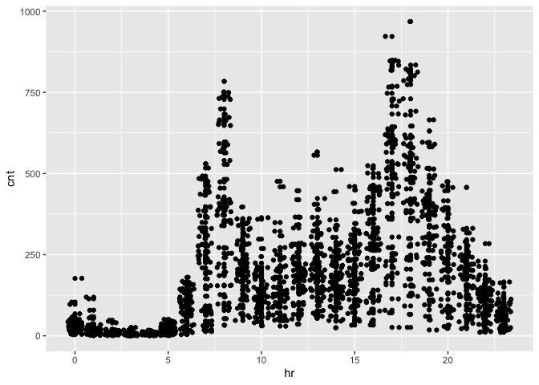
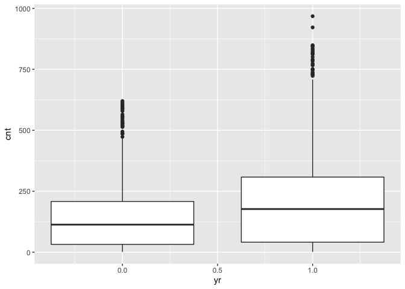
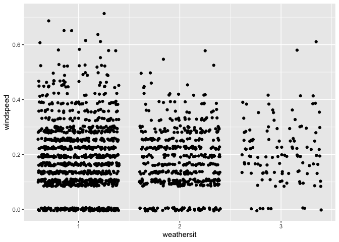
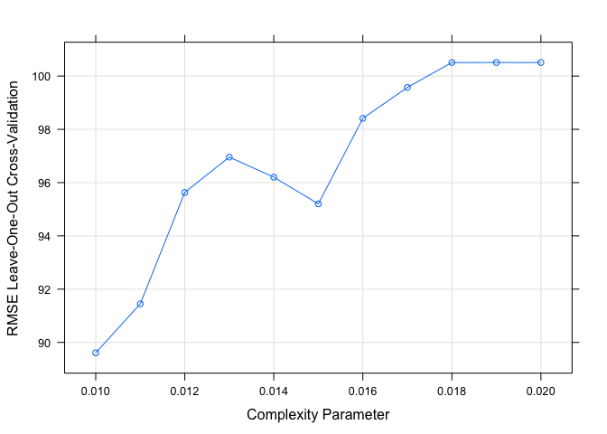
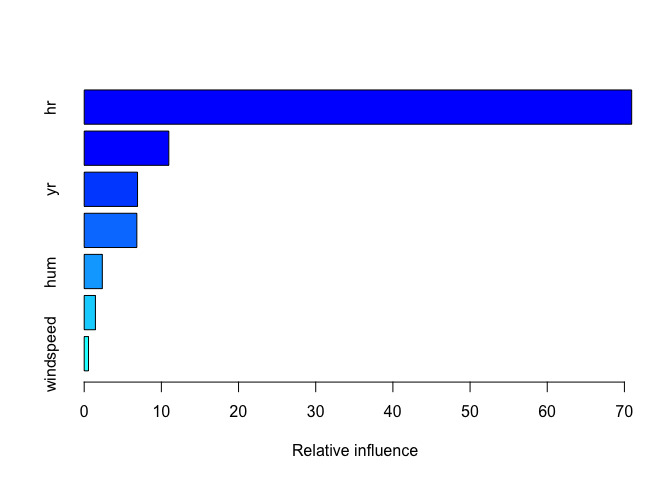
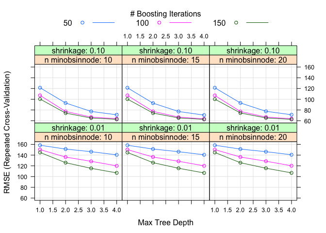

Monday
================
Shih-Ni Prim
2020-10-16

## Introduction

Now we take a look at Monday’s analysis. This dataset contains
information about [bike
sharing](https://archive.ics.uci.edu/ml/datasets/Bike+Sharing+Dataset).
We have a variety of predictors, including hours, temperature, humidity,
weekday, holiday/workday or not, etc. In our analysis, We will use two
statistical learning models–regression tree and boosted tree–to predict
the count of total rental bikes `cnt`.

## Setting the Value for the Parameter

Since the current analysis is on Monday, we first find the corresponding
value for it.

``` r
set.seed(7777)
i <- 0:6
dayz <- c("Sunday", "Monday", "Tuesday", "Wednesday", "Thursday", "Friday", "Saturday")
df <- as.data.frame(cbind(i, dayz))
weekdayNum <- df$i[df$dayz == params$weekday]
print(weekdayNum)
```

    ## [1] 1
    ## Levels: 0 1 2 3 4 5 6

## Data

Now we read in the data. Two datasets are listed on [the
link](https://archive.ics.uci.edu/ml/datasets/Bike+Sharing+Dataset), one
including the `hr` variable, and one treating each day as one
observation and thus not including the `hr` variable. Since hours–the
time in the day–should be a meaningful predictor for the number of bike
rentals, we use the dataset with the `hr` variable

``` r
bikes <- read_csv("Bike-Sharing-Dataset/hour.csv")
```

    ## Parsed with column specification:
    ## cols(
    ##   instant = col_double(),
    ##   dteday = col_date(format = ""),
    ##   season = col_double(),
    ##   yr = col_double(),
    ##   mnth = col_double(),
    ##   hr = col_double(),
    ##   holiday = col_double(),
    ##   weekday = col_double(),
    ##   workingday = col_double(),
    ##   weathersit = col_double(),
    ##   temp = col_double(),
    ##   atemp = col_double(),
    ##   hum = col_double(),
    ##   windspeed = col_double(),
    ##   casual = col_double(),
    ##   registered = col_double(),
    ##   cnt = col_double()
    ## )

``` r
# head(bikes)
analysis <- bikes %>% filter(weekday == weekdayNum) %>% select(-casual, -registered) %>% select(dteday, weekday, everything()) 
# head(analysis)
```

## Splitting Data

We first split up the data into two sets: training and test sets. The
training set has about 70% of the data, and the test set has about 30%.
Splitting up the data is important, because we want to test the model on
a set that is not used in training, otherwise we risk overfitting.

``` r
train <- sample(1:nrow(analysis), size = nrow(analysis)*0.7)
test <- setdiff(1:nrow(analysis), train)

bikeTrain <- analysis[train,]
bikeTest <- analysis[test,]
```

## Summaries and Exploratory Data Analysis

To decide which variables to include in our models, we first take a
quick look at the data. We can look at summaries of numerical variables.

``` r
summary(bikeTrain)
```

    ##      dteday              weekday     instant          season     
    ##  Min.   :2011-01-03   Min.   :1   Min.   :   48   Min.   :1.000  
    ##  1st Qu.:2011-06-27   1st Qu.:1   1st Qu.: 4170   1st Qu.:2.000  
    ##  Median :2011-12-19   Median :1   Median : 8359   Median :2.000  
    ##  Mean   :2011-12-26   Mean   :1   Mean   : 8542   Mean   :2.481  
    ##  3rd Qu.:2012-06-25   3rd Qu.:1   3rd Qu.:12872   3rd Qu.:3.000  
    ##  Max.   :2012-12-31   Max.   :1   Max.   :17379   Max.   :4.000  
    ##        yr              mnth             hr           holiday      
    ##  Min.   :0.0000   Min.   : 1.00   Min.   : 0.00   Min.   :0.0000  
    ##  1st Qu.:0.0000   1st Qu.: 4.00   1st Qu.: 6.00   1st Qu.:0.0000  
    ##  Median :0.0000   Median : 7.00   Median :12.00   Median :0.0000  
    ##  Mean   :0.4916   Mean   : 6.46   Mean   :11.52   Mean   :0.1452  
    ##  3rd Qu.:1.0000   3rd Qu.: 9.00   3rd Qu.:17.00   3rd Qu.:0.0000  
    ##  Max.   :1.0000   Max.   :12.00   Max.   :23.00   Max.   :1.0000  
    ##    workingday       weathersit         temp            atemp       
    ##  Min.   :0.0000   Min.   :1.000   Min.   :0.0200   Min.   :0.0606  
    ##  1st Qu.:1.0000   1st Qu.:1.000   1st Qu.:0.3400   1st Qu.:0.3333  
    ##  Median :1.0000   Median :1.000   Median :0.5200   Median :0.5000  
    ##  Mean   :0.8548   Mean   :1.435   Mean   :0.4948   Mean   :0.4751  
    ##  3rd Qu.:1.0000   3rd Qu.:2.000   3rd Qu.:0.6600   3rd Qu.:0.6212  
    ##  Max.   :1.0000   Max.   :3.000   Max.   :0.9200   Max.   :0.8485  
    ##       hum          windspeed           cnt       
    ##  Min.   :0.150   Min.   :0.0000   Min.   :  1.0  
    ##  1st Qu.:0.490   1st Qu.:0.1045   1st Qu.: 36.0  
    ##  Median :0.640   Median :0.1642   Median :136.0  
    ##  Mean   :0.635   Mean   :0.1888   Mean   :182.1  
    ##  3rd Qu.:0.780   3rd Qu.:0.2537   3rd Qu.:268.0  
    ##  Max.   :1.000   Max.   :0.7164   Max.   :968.0

Below we look at three plots. The first plot shows the histogram of bike
rentals (`cnt`) on Monday. The second plot shows that `cnt` does vary in
different hours. The third plot shows that `cnt` varies between the two
years. So we know we should keep `hr` and `yr` as
    predictors.

``` r
ggplot(bikeTrain, mapping = aes(x = cnt)) + geom_histogram()
```

    ## `stat_bin()` using `bins = 30`. Pick better value with `binwidth`.

<!-- -->

``` r
ggplot(bikeTrain, aes(x = hr, y = cnt)) + geom_point() + geom_jitter()
```

<!-- -->

``` r
ggplot(bikeTrain, aes(x = yr, y = cnt)) + geom_boxplot(aes(group = yr))
```

<!-- -->

Next we look at correlations of different variables. Weather and
windspeed do not seem correlate, so we will keep both `weathersit` and
`windspeed`.

``` r
ggplot(bikeTrain, aes(x = weathersit, y = windspeed)) + geom_jitter()
```

<!-- -->

Several pairs of variables seem highly correlated–`season` and `mnth`,
`holiday` and `workingday`–so we’ll remove one from each pair.

``` r
cor(bikeTrain$season, bikeTrain$mnth)
```

    ## [1] 0.840952

``` r
cor(bikeTrain$holiday, bikeTrain$workingday)
```

    ## [1] -1

``` r
cor(bikeTrain$temp, bikeTrain$atemp)
```

    ## [1] 0.9931593

The variance of `workingday` and `holiday` are too small and probably
not good predictors.

``` r
var(bikeTrain$holiday)
```

    ## [1] 0.1242205

``` r
var(bikeTrain$workingday)
```

    ## [1] 0.1242205

Also, `instant` and `dteday` are for record-keeping. Thus, we decide to
keep the following variables as the predictors: `season`, `yr`, `hr`,
`weathersit`, `atemp`, `hum`, and
`windspeed`.

``` r
bikeTrain <- select(bikeTrain, season, yr, hr, weathersit, atemp, hum, windspeed, cnt)
bikeTest <- select(bikeTest, season, yr, hr, weathersit, atemp, hum, windspeed, cnt)
```

## Fitting models

Now we have a final training set and have chosen the predictors, we can
use two models–regression tree and boosted tree–to fit the training
data.

### Regression tree

A regression tree is one of the tree based methods for supervised
learning with the goal of predicting a continuous response. It splits up
predictor space into different regions, and the prediction of each
region is often the mean of observations in that region.

For regression tree, we use the `caret` package and apply the
leave-one-out cross validation method (thus the argument `method =
"LOOCV"`). We set the `tuneLength` as 10 and let the model chooses the
best model automatically.

``` r
modelLookup("rpart")
```

    ##   model parameter                label forReg forClass probModel
    ## 1 rpart        cp Complexity Parameter   TRUE     TRUE      TRUE

``` r
bikeTree <- train(cnt ~ ., data = bikeTrain, method = "rpart", trControl = trainControl(method = "LOOCV"), tuneGrid = expand.grid(cp = seq(0.01, 0.02, 0.001)))
```

Below we can see the final model; the resulting RMSE, Rsquared, and MAE
of different cp; and a plot that shows the relationship between cp and
RMSE.

``` r
bikeTree$finalModel
```

    ## n= 1735 
    ## 
    ## node), split, n, deviance, yval
    ##       * denotes terminal node
    ## 
    ##   1) root 1735 54385280.0 182.06860  
    ##     2) hr< 6.5 494   604586.9  26.11134 *
    ##     3) hr>=6.5 1241 36982380.0 244.14990  
    ##       6) season< 1.5 313  3951716.0 131.58790  
    ##        12) yr< 0.5 150   440639.3  84.53333 *
    ##        13) yr>=0.5 163  2873326.0 174.88960  
    ##          26) atemp< 0.3106 115  1032755.0 133.93040 *
    ##          27) atemp>=0.3106 48  1185413.0 273.02080 *
    ##       7) season>=1.5 928 27727290.0 282.11530  
    ##        14) hr>=20.5 163   855545.8 140.82210 *
    ##        15) hr< 20.5 765 22924300.0 312.22090  
    ##          30) hr< 16.5 552  9986582.0 259.04890  
    ##            60) hr>=8.5 438  4335261.0 229.43150  
    ##             120) yr< 0.5 226  1281190.0 184.33630 *
    ##             121) yr>=0.5 212  2104543.0 277.50470  
    ##               242) hr< 15.5 181  1263510.0 256.37570 *
    ##               243) hr>=15.5 31   288431.5 400.87100 *
    ##            61) hr< 8.5 114  3790937.0 372.84210  
    ##             122) yr< 0.5 56   611053.7 282.42860 *
    ##             123) yr>=0.5 58  2280113.0 460.13790  
    ##               246) hr< 7.5 29   585392.8 349.79310 *
    ##               247) hr>=7.5 29   988513.2 570.48280 *
    ##          31) hr>=16.5 213  7332570.0 450.01880  
    ##            62) hr>=18.5 101  1359977.0 337.95050 *
    ##            63) hr< 18.5 112  3560198.0 551.08040  
    ##             126) yr< 0.5 62   940277.4 459.09680 *
    ##             127) yr>=0.5 50  1444860.0 665.14000  
    ##               254) hum>=0.795 7   152802.9 403.85710 *
    ##               255) hum< 0.795 43   736381.4 707.67440 *

``` r
bikeTree
```

    ## CART 
    ## 
    ## 1735 samples
    ##    7 predictor
    ## 
    ## No pre-processing
    ## Resampling: Leave-One-Out Cross-Validation 
    ## Summary of sample sizes: 1734, 1734, 1734, 1734, 1734, 1734, ... 
    ## Resampling results across tuning parameters:
    ## 
    ##   cp     RMSE       Rsquared   MAE     
    ##   0.010   89.60842  0.7442837  61.05418
    ##   0.011   91.44549  0.7333711  61.80337
    ##   0.012   95.63097  0.7085497  65.50042
    ##   0.013   96.95736  0.7001967  66.20332
    ##   0.014   96.20340  0.7048526  65.28622
    ##   0.015   95.20133  0.7108728  65.01087
    ##   0.016   98.41169  0.6911484  66.11388
    ##   0.017   99.57242  0.6839224  66.94487
    ##   0.018  100.50831  0.6777358  69.52024
    ##   0.019  100.50831  0.6777358  69.52024
    ##   0.020  100.50831  0.6777358  69.52024
    ## 
    ## RMSE was used to select the optimal model using the smallest value.
    ## The final value used for the model was cp = 0.01.

``` r
plot(bikeTree)
```

<!-- -->

Finally we use the model to predict `cnt` on the test data and calculate
RMSE to check the fit of the model.

``` r
predTree <- predict(bikeTree, newdata = bikeTest)
treeResult <- postResample(predTree, bikeTest$cnt)
```

### Boosted Tree

A boosted tree is one of the ensemble learning methods, in which the
tree grows sequentially. Each subsequent tree is combined into the
previous model to produce a modified model. The predictions are updated
as the tree grows.

We again use `caret` package and set the method as `gbm`. We use
repeated cross validation (`repeatedcv`) and set the `tuneLength` as 10
and let the model chooses the best model
    automatically.

``` r
modelLookup("gbm")
```

    ##   model         parameter                   label forReg forClass probModel
    ## 1   gbm           n.trees   # Boosting Iterations   TRUE     TRUE      TRUE
    ## 2   gbm interaction.depth          Max Tree Depth   TRUE     TRUE      TRUE
    ## 3   gbm         shrinkage               Shrinkage   TRUE     TRUE      TRUE
    ## 4   gbm    n.minobsinnode Min. Terminal Node Size   TRUE     TRUE      TRUE

``` r
grid <- expand.grid(n.trees = c(50, 100, 150), interaction.depth = 1:4, shrinkage = c(0.1, 0.01), n.minobsinnode = c(10, 15, 20))

boostedBike <- train(cnt ~  season + yr + hr + weathersit + atemp + hum + windspeed, data = bikeTrain, method = "gbm", preProcess = c("center", "scale"), trControl = trainControl(method = "repeatedcv", number = 10, repeats = 3), tuneGrid = grid, verbose = FALSE)
```

Below we can see some information about the final model, the predictors
chosen and their importance, and a plot that shows how RMSE changes with
different numbers of boosting iterations and tree depths.

``` r
boostedBike$finalModel
```

    ## A gradient boosted model with gaussian loss function.
    ## 150 iterations were performed.
    ## There were 7 predictors of which 7 had non-zero influence.

``` r
summary(boostedBike)
```

<!-- -->

    ##                   var    rel.inf
    ## hr                 hr 70.9411490
    ## atemp           atemp 10.9651576
    ## yr                 yr  6.9117079
    ## season         season  6.8217024
    ## hum               hum  2.3473304
    ## weathersit weathersit  1.4540255
    ## windspeed   windspeed  0.5589273

``` r
plot(boostedBike)
```

<!-- -->

Finally, we use the model to predict `cnt` on the test data and
calculate RMSE to check the fit of the
model.

``` r
predBoostedBike <- predict(boostedBike, newdata = select(bikeTest, -cnt))
boostedResult <- postResample(predBoostedBike, bikeTest$cnt)
```

### Comparison

We can put the testing RMSE from the two models together for comparison.

``` r
comparison <- data.frame(rbind(t(treeResult), t(boostedResult)))
colnames(comparison) <- c("RMSE", "Rsquared", "MAE")
rownames(comparison) <- c("Regression Tree", "Boosted Tree")
knitr::kable(comparison)
```

|                 |     RMSE |  Rsquared |      MAE |
| --------------- | -------: | --------: | -------: |
| Regression Tree | 86.24855 | 0.7840005 | 58.51697 |
| Boosted Tree    | 58.68406 | 0.9027419 | 38.39205 |

### Final Model

``` r
# a function to generate the name of the best model
model <- function(x, y){
  xscore <- 0
  if (x[[1]] < y[[1]]) {
    xscore = xscore + 1
  }
  if (x[[2]] > y[[2]]){
    xscore = xscore + 1
  }
  if (x[[3]] < y[[3]]){
    xscore = xscore + 1
  }
  if (xscore == 2 || xscore == 3){
    final <- c("regression tree")
  } else {
    final <- c("boosted tree")
  }
  return(final)
}
# model(treeResult, boostedResult)
```

From the output, we can conclude that the boosted tree is the better
model for Monday data, because it has better performance in terms of
RMSE, Rsquared, and MAE.

### Linear regression model

I fit the multiple linear regression model for the predictors `season`,
`yr`, `hr`, `weathersit`, `atemp`, `hum`, `windspeed`, and response is
`cnt`.

``` r
mlrFit <- lm(cnt~., data = bikeTrain)
mlr <- train(cnt ~ ., data = bikeTrain, method = "lm",
preProcess = c("center", "scale"),
trControl = trainControl(method = "cv", number = 10))
mlr
```

    ## Linear Regression 
    ## 
    ## 1735 samples
    ##    7 predictor
    ## 
    ## Pre-processing: centered (7), scaled (7) 
    ## Resampling: Cross-Validated (10 fold) 
    ## Summary of sample sizes: 1562, 1562, 1560, 1560, 1563, 1562, ... 
    ## Resampling results:
    ## 
    ##   RMSE      Rsquared   MAE     
    ##   141.6877  0.3609686  103.5574
    ## 
    ## Tuning parameter 'intercept' was held constant at a value of TRUE

``` r
mlr$results
```

    ##   intercept     RMSE  Rsquared      MAE   RMSESD RsquaredSD    MAESD
    ## 1      TRUE 141.6877 0.3609686 103.5574 9.510305 0.04759577 6.766531

``` r
pred <- predict(mlr, newdata = bikeTest)
pred_mlr <- postResample(pred, obs = bikeTest$cnt)
pred_mlr
```

    ##        RMSE    Rsquared         MAE 
    ## 147.9306265   0.3604575 108.2057686

We can compare both linear regression model and nonlinear model, choose
the one with comparatively smaller RMSE, smaller MAE and bigger
Rsquared.
